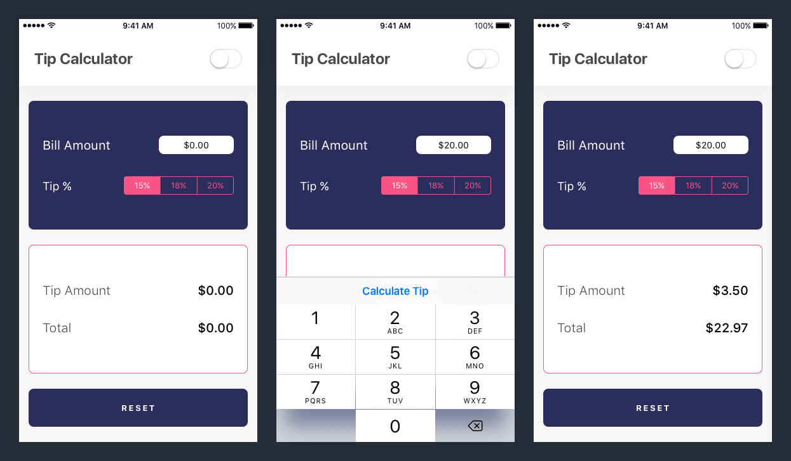

This is the second tutorial of Make School's iOS app tutorial series. In this tutorial, we'll learn core concepts for creating UI layouts by building a tip calculator.

## Why A Tip Calculator?

In the US, it's customary to leave a tip for waiting staff like bartenders and waiters. An accepted range for the tip, also known as gratuity, is between 15% to 20% of your total bill.

Instead of having to do the math in your head, we'll build a simple tip calculator to calculate the tip for us.

# Who Is This For?

iOS Beginners with a basic understanding of navigating and using Xcode. This tutorial will focus on building intermediate-level UI with _Interface Builder_.

## What You Should Already Know

This tutorial builds on key concepts from the first Make School tutorial on building a _Magic 8-Ball_. You should have a understanding of the fundamentals of how to build simple iOS apps and how to navigate Xcode.

If you're a complete beginner and looking for your first introduction to iOS development, it's recommended to first complete the previous Make School tutorial on building a _Magic 8-Ball_.

## Estimated Completion Time:

1.5 hours

# What We're Building

At the end of this tutorial, you'll have built your own tip calculator!

Your tip calculator will be able to:

1. Enter a base bill amount to calculate your tip.
2. Select a tip percentage of 15%, 18%, or 20%.
3. Calculate the tip amount and total bill amount.
4. Toggle the theme between light and dark mode.
5. Clear and reset your tip calculator.

# What You'll Learn

By the end of this tutorial, you will:

- visually breakdown designs into UI components
- learn about common UIKit objects
- use auto-layout and stack views to create dynamically re-sizing layouts
- configuring UI object properties programmatically

# If You Get Stuck

Getting stuck when coding (and debugging) is a natural part of the programming process. If you find yourself stuck on a problem or lost, pause for a moment and take a breath. Maybe take a walk. Then retrace your steps (in the tutorial, not the walk.) Make sure you've follow each step of the tutorial. It's easy to make typos or to accidentally skip over important steps.

If you want to compare your code to the solution, you can find it here.

TODO: insert link to github repo
