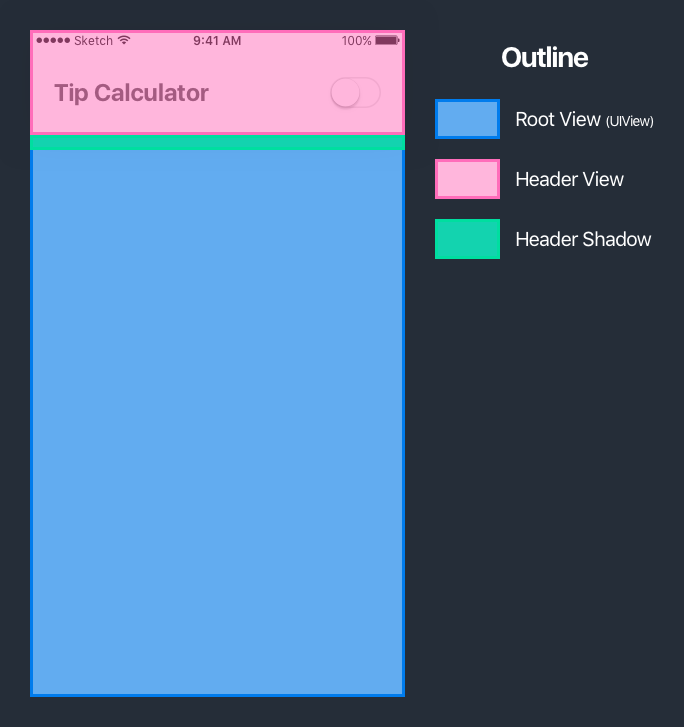

Before we jump into Xcode, we'll first take some time to review and breakdown our tip calculator design. We'll learn to visually break apart designs into smaller chunks that we can code one at a time.


> [info]
In this tutorial, we'll often refer to the terms _UI_ (user interface) and _view_. Both terms refer to building the app's user interface, or the visual elements on the screen that the user interacts with.

# Reviewing Our Design

Let's take another look at the designs for the tip calculator app that we're going to build:


Listing the steps for each screen above (left to right):

1. Empty state when a user first opens the app or taps the reset button.
2. User inputs a bill amount into bill amount field using the iOS keyboard.
3. After hitting the _Calculate_ button or selecting a tip percentage, dismiss the keyboard and show the tip amount and total bill amount.

The user also can toggle the app's color theme from light-mode to dark-mode using the switch in the top-right corner. In dark-mode, our tip calculator will look like:


We've reviewed our app designs. Next, let's learn to visually breakdown our design into smaller parts.

# Design Breakdown

Implementing an app design without any planning can be overwhelming. It's hard to know where to start.

Instead, let's take our designs and visually break down elements into smaller groups that we can implement one at a time.


If you're doing this process on your own, it's helpful to use pen and paper.

At this point, you might be thinking, "Why did we group each of the UI elements in the way we did?" Why not any of the other following options?


To answer this question, we'll have to learn about the basic UI building block, _UIView_.

## What Is A UIView?

The _UIView_ class is an object that represents a rectangular area on your iPhone screen. Your entire UI (with few exceptions), is built from multiple _UIView_ objects.

To better understand this, let's take a look at Square Cash, an app that allows you to send and recieve money.


As you can see, the whole screen has a base `UIView` (blue color) that we've named the root view. This will usually be the root view of the respective active `UIViewController`.

On top of the root, you can add subviews. These subviews are `UIView` objects or `UIView` subclasses. In the _Square Cash_ app, the UI consists of buttons and labels but there are many other type of UI objects `UIKit` provides.

> [info]
**What is UIKit?**
>
`UIKit` is a framework that provides pre-built objects and functionality that you can use to build iOS apps. This includes a lot of under-the-hood functionality (handling your app's lifecycle and resource management) as well as commonly used UI components (buttons and labels.)

<!-- break -->

> [challenge]
Identify each of the `UIView` objects in the tip calculator design. You can reference the design below:
>


<!-- break -->

> [solution]
If you break down the tip calculator design into it's individual subviews you should get the following:
>

>
You'll notice many new UI components that we're using from UIKit. Each of these UI objects either are or inherit from `UIView`. We'll formally introduce each of these UI objects later in this tutorial.

## Grouping Subviews

It's common to organize our subviews in groups. Although you can technically group subviews however you'd like, usually groups are based on how you plan to position and layout your UI (more on this later.)

Using our _Square Cash_ example, you might group each of the subviews in the following manner:


This makes it easier to re-position entire groups of views. i.e. repositioning the entire header up or down a few pixels

Let's apply the steps we just took with the _Square Cash_ app to our own tip calculator design.

> [challenge]
Group each of the view elements together using where you left off from the previous challenge. Check your answer in the solution when you're done. You can reference the design below:
>


<!-- break  -->

> [solution]
You should have grouped each of the individual view objects from the previous challenge as follows:
>


<!-- TODO: better explanation of how we grouped these elements together -->

# Introducing UI Objects From UIKit

In the previous section we identified each of the UIView objects and grouped them into 4 main groups:

1. Header - displays app title and theme switch
1. Tip Input - provides UI elements for user input
1. Tip Output - displays output of tip calculator
1. Reset Button - resets calculator to starting state

Now, we'll go through and introduce all of the UI components we'll use from UIKit. These UI objects are meant to be basic building blocks to create your app's UI.

## Header

The header is a custom view on the view controller's root view.



As you can see, the header is a `UIView` placed on top of the root view. Additionally, it has two subviews place on top of the header view itself: a label and switch.

### UILabel

`UILabel` directly subclasses `UIView` and is used to display text on the iOS device's screen.


The `UILabel` class can be configured from it's many properties. (i.e. text, font, text color, number of lines, etc.)

<!-- In our case, we'll use an off-black (#4A4A4A) text color and bold font weight of `San Francisco`, the default system font created by Apple. -->

In our case, we use this label to display title text for our tip calculator app.

### UISwitch

The `UISwitch` object is a subclass of `UIControl`, which is a subclass of `UIView`.

```
class UISwitch : UIControl, NSCoding { ... }

class UIControl : UIView { ... }
```

All UI objects that we'll use from `UIKit` will inherit from the `UIView` class.

A switch is the default UI component for toggling between an on and off state. You can think of it as the iOS version of a light switch.


When toggled on, the switch will change the color theme of the app from light to dark.


## Tip Input

The next group of views allows the user to provide input to calculate the bill amount and tip percentage for the bill.


As with the header view, we'll break down this group of UI components into it's individual components.

### UILabel

We've already covered the `UILabel` class, so we won't cover it again.

> [challenge]
Identify the `UILabel`(s) objects on the tip input card view.

<!-- break -->

> [solution]
Both labels are on the left-side on the tip input card view: 

### UITextField

The `UITextField` provides a text field where the user can input text with the iOS keyboard.


When a user taps a text field, the text field will become active (referred to as the first responder) and the device keyboard will appear.


We'll need the text field for the user to input their bill amount.

### UISegmentedControl

Similar to the switch, the `UISegmentedControl` class provides a UI object that allows the user to toggle between different options. The main different being that a segmented control can have 2+ different states, while a switch can only toggle in-between an on and and off state.

In addition to 2+ toggle states, switches can also have each option name labeled. Let's take a look at the segmented control we'll use in our tip calculator.


Our tip calculator will need a segmented control so that the user can choose the tip percentage they want to use for calculating gratuity.

## Tip Output

The tip output group provides the output tip amount and total bill amount of the tip calculator.


We've already introduced all of the UI objects in this group.

> [challenge]
Identify all of the different UIKit objects in the tip output group.

<!-- break -->

> [solution]
The entire tip output group is made up of a card view that is a `UIView` with 4 `UILabel` for each respective title and amount.
>


## Reset Button

Next, we'll introduce the last UIKit object that we'll need for our tip calculator: `UIButton`.


Simple enough, this grouping will consist only of a single element: a button.

### UIButton

The `UIButton`, along with labels, are one of the most common objects for building your UI. A user can interact with a button by tapping it and triggering an event. This event can be tied to calling a function and running code.


Our reset button will allow a user to clear the current input from our tip calculator and reset it to a empty state.

> [info]
You don't need to memorize all of the UIKit objects we've just covered. Just remember that there are pre-made UI components that you can use to build your UI. If you're trying to build any type of visual element, check `UIKit` to see if there's a base UI object you can use to build off of.

# Reviewing What We've Learning

We've reviewed and learned about many new UI objects in `UIKit`. You'll use these objects as basic building blocks for creating various UI for your app. If you're ever looking for a comphrensive guide of all of the UIKit objects, you can reference Apple's developer docs by [clicking here](https://developer.apple.com/documentation/uikit/views_and_controls).

Moving forward, we'll start building tip calculator in Xcode and look at how to use each of these UI components.
