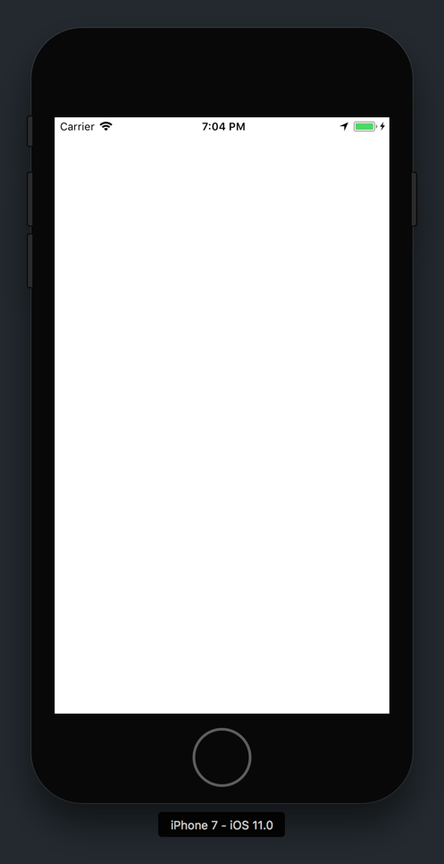
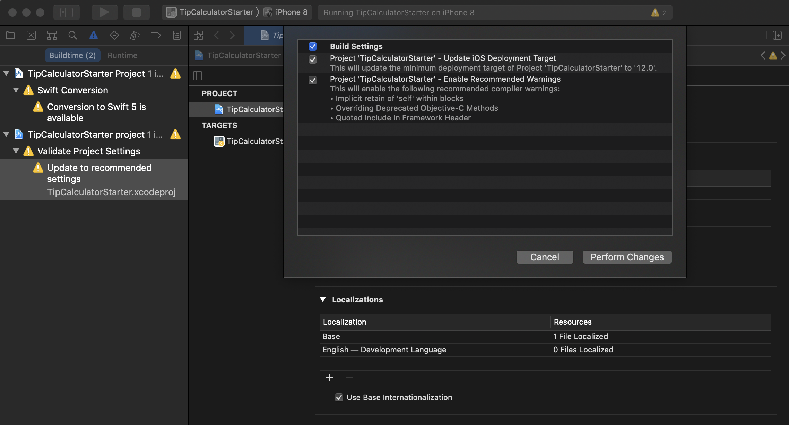
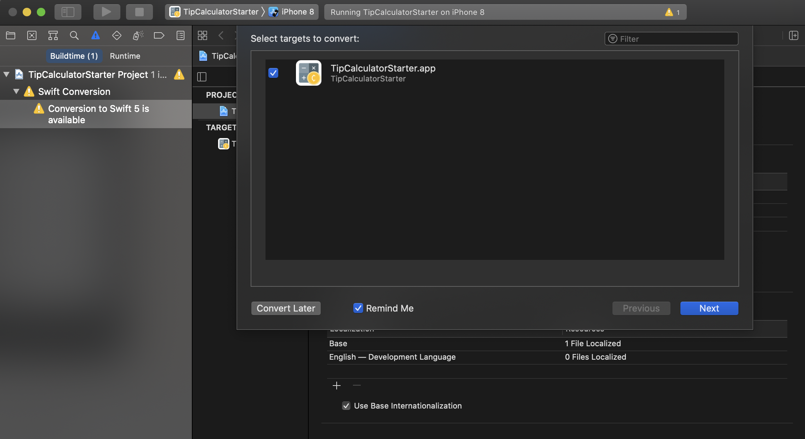
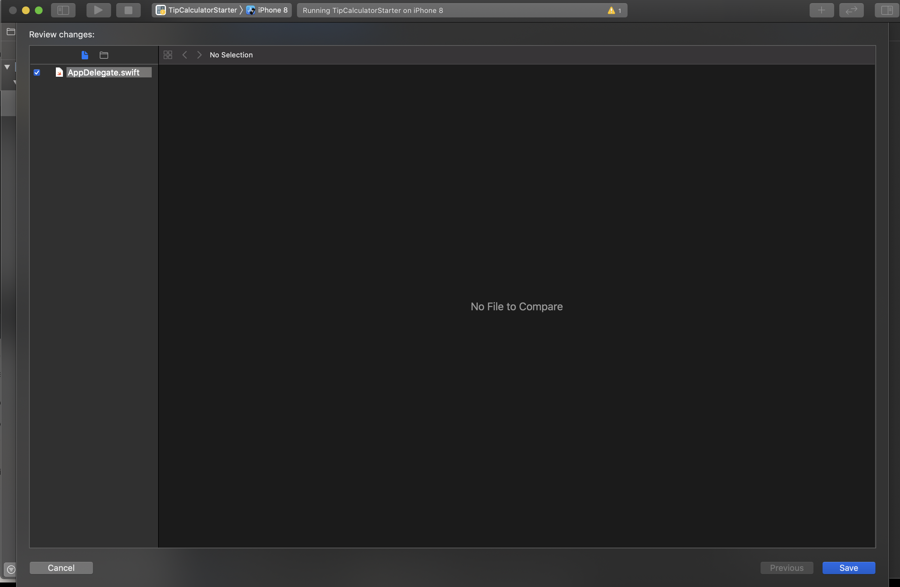

In this section, we'll get introduced to our new Xcode project and start working on implementing our tip calculator design.

We'll get started by downloading a Xcode starter project. You can download the `.zip` file by [clicking here.](https://github.com/ocwang/TipCalculatorStarter/archive/master.zip)

# In Your Starter Project

After downloading the starter project, open the project in Xcode. You should see something the following:


Build and run the current starter project in a simulator or iPhone device of your choice.

> [action]
Run the new starter project to make sure there are no compilation errors. If all goes well, your project should run successfully and display an empty white screen (we haven't built anything yet!)
>


## Addressing Possible Warnings 

> [action]
Alternatively, if you have a few warnings pop up (which can happen as XCode and Swift are constantly growing, changing, and updating), you can move forward with clicking the **Perform Changes** button. 
>


> [action]
You may also have a warning to convert the starter project to the latest Swift version. The warning will look similar to the following. Feel free to move forward with the update. 
>

Wrap up by saving the changes! 



Next, let's take a look inside our starter project.

## View Controller

<!-- TODO: considering adding a section about directory layout? -->

First, we'll start with our view controller.

> [action]
Using the _Project Navigator_, open the `ViewController.swift` source file. You should see the following code:
>
```
class ViewController: UIViewController {
>
    // MARK: - View Lifecycle
>
    override func viewDidLoad() {
        super.viewDidLoad()
    }
}
```

Just boilerplate code, nothing is happening yet. We'll eventually write our tip calculator logic in here later.

## Main Storyboard

Let's move onto our storyboard.

> [action]
Open `Main.storyboard` from your _Project Navigator_. You'll see the following:
>


Right now there's an empty, white view controller. (The one we saw in our simulator remember?)

Let's review how our storyboard view controller is connected to our `.swift` file.

> [action]
Click on the view controller representation in your storyboard. With your storyboard view controller selected, navigate to the _Class Inspector_ in the _Utilities area_.
>
You'll notice that the `ViewController.swift` source code is paired with the View Controller object in your `Main.storyboard`.
>


Next we'll take a look at our project's assets.

## XCAssets

Your project assets contain your media: images, movies, app icons, etc.

> [action]
Open `Assets.xcassets` to see your project assets. 

In your asset catalog, you should see an app icon that's already set for you and two folders containing pre-defined color sets for the different color themes we'll implement later.

To pair with our custom colors in our asset catalog, your project also contains a `UIColor` extension that allows you to access each of the app's colors through code.

> [action]
Open `UIColor+TC.swift` from your _Project Navigator_. If you don't see it, you'll have to expand the `Supporting Files` folder in your _Project Navigator_. You should see the following:
>
```
import UIKit.UIColor
>
extension UIColor {
>
    // MARK: Theme Colors
>
    static var tcDarkBlue: UIColor {
        return UIColor(named: "tcDarkBlue")!
    }
>
    static var tcOffWhite: UIColor {
        return UIColor(named: "tcOffWhite")!
    }
>
    static var tcHotPink: UIColor {
        return UIColor(named: "tcHotPink")!
    }
>
    static var tcCharcoal: UIColor {
        return UIColor(named: "tcCharcoal")!
    }
>
    static var tcAlmostBlack: UIColor {
        return UIColor(named: "tcAlmostBlack")!
    }
>
    static var tcMediumBlack: UIColor {
        return UIColor(named: "tcMediumBlack")!
    }
>
    static var tcBlueBlack: UIColor {
        return UIColor(named: "tcBlueBlack")!
    }
>
    static var tcSeafoamGreen: UIColor {
        return UIColor(named: "tcSeafoamGreen")!
    }
>
    static var tcBlack: UIColor {
        return UIColor(named: "tcBlack")!
    }
>
    static var tcWhite: UIColor {
        return UIColor(named: "tcWhite")!
    }
}
```

This file pairs each of the class variables to the custom color sets defined in our asset catalog.

Once we start coding, we'll be able to access each respective color through the `UIColor` class variable:

```
let selectedColor = UIColor.tcSeafoamGreen
```

Notice that we prefix each of our custom colors with `tc` to avoid namespace conflicts and make our colors easier to find with Xcode autocomplete.

> [info]
In this project, your custom colors have been defined in your asset catalog, however this is just one of many ways for defining custom colors. You can also create custom colors programmatically or through _Interface Builder_.

## App Delegate

To wrap up our new project tour, let's briefly take a look at our _App Delegate_.

> [action]
Open `AppDelegate.swift` from your project navigator:
>
```
import UIKit
>
@UIApplicationMain
class AppDelegate: UIResponder, UIApplicationDelegate {
>
    var window: UIWindow?
>
    // MARK: - App Lifecycle
>
    func application(_ application: UIApplication, didFinishLaunchingWithOptions launchOptions: [UIApplicationLaunchOptionsKey: Any]?) -> Bool {
        // Override point for customization after application launch.
        return true
    }
}
```

<!-- break -->

> [info]
For this tutorial, you won't need to change or modify the _App Delegate_. However, it's helpful to know about it's purpose for when you start writing your own apps.

Each iOS Xcode project must have an `AppDelegate.swift` file which is responsible for the app's lifecycle. The app delegate specifies what happens when app lifecycle events are triggered. Common example events are app launch, receiving a push notification, app termination, etc.

In our tip calculator's app delegate, we don't add any code other than the boilerplate `application(_:didFinishLaunchingWithOptions:)` method that comes by default in each Xcode project template.

## Wrapping Up

We've just taken a look at the files in our new Xcode starter project. Throughout this tutorial, we'll continue to build on this project to create our final tip calculator.

Let's get started by diving into storyboard and creating our views for our UI.
