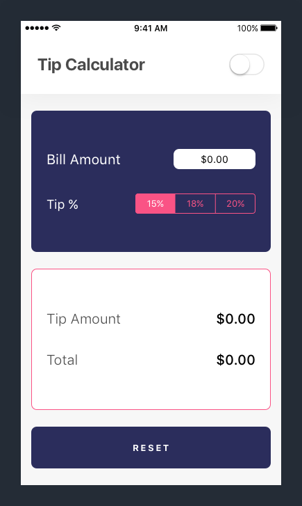

We'll start building our app by implementing the UI in _Interface Builder_. For reference, here are the tip calculator designs:

# Creating Views

We'll get started by creating our header view with a `UIView`.

> [info]
`UIKit` has it's own header-like bar called the `UINavigationBar`. To keep things simple, we'll start from scratch and create our own header view instead of using iOS's `UINavigationBar`.

<!-- break -->

> [action]
Open `Main.storyboard` from your project navigator. You should see your single view controller. 

Next, we'll add a `UIView` and reposition/resize it to be our header view.

> [action]
Create a header view by dragging an `UIView` object from the _Object Library_ to the top of the view controller. Don't worry too much about the perfect size and position for now. We'll handle that later.
>

The new `UIView` object that we just added is going to be our custom header view. We'll add other subviews onto it later.

You might notice, that our header view is a little hard to see because it's the same color as the view controller's root view: white. Let's change the color of our root view to add some contrast.

> [action]
Change the view controller's root view to off-white:
>
1. Select the view controller's root view by either clicking on it in your storyboard or selecting it in the document outline. If you don't see it in the _Document Outline_, you might have to expand the `View Controller Scene` tree. Make sure you're not selecting the header view by accident. 
1. With the root view still selected, open the _Attributes Inspector_ in the _Utilities area_. 
1. Next, click on the blue dropdown button beside the active color for the `Background Color` field. 
1. Finally, select the `Off-White` color under the _Named Colors_ subheader in the dropdown menu. 

We've changed the _background color_ attribute of the root view to a different color. The `Off White` color we chose was pre-defined in our `Assets.xcasset` asset catalog.

Before we add more views or configure more properties, let's learn about the iOS coordinate system and the frame attribute of `UIView` and it's subclasses. We'll need to learn about the iOS coordinate system to properly position and size our views.

# iOS Coordinate System

You can think of your phone screen as a coordinate system with it's origin in the top-left corner.

As we've previously discussed, view can be represented as rectangles drawn on our device's screen. This rectangle can be represented by it's starting point (top-left corner of the rectangle) along with it's size (width and height). Let's look at an example:

<!-- break -->

> [challenge]
In the image above, what is the red view's starting point? What about it's size?

<!-- break -->

> [solution]
As you can see from the numbered X and Y axis, the view rectangle starts at the point (27, 48) in the iOS coordinate system and has a width of 50pts and a height of 35pts.

In Swift, we have the `CGPoint` and `CGSize` data types to represent coordinate points and sizes respectively. A `CGPoint` value is a pair of X and Y values. A `CGSize` value is a pair of width and height values.

Additionally, these two data types can be combined into `CGRect` data type (X, Y, width, height) that represents a rectangle represented by it's point and size properties.

Each `UIView` has a property called it's `frame` of type `CGRect`. You can use each view's frame property to manipulate it's position and size.

> [info]
At some point, you'll come across another view property named `bounds` that's also a `CGRect`. The `frame` of a view represents the view's rectangle in it's super view's coordinate system while it's `bound` property refers to the rectangle using the view's top-left corner as the origin of it's coordinate system. In other words, the `bounds` property of a view will always have an (x, y) of (0, 0) and retain it's size.
>

With our new knowledge, let's properly re-position and re-size our header view.

## Setting The Header View Rect

Looking back at our design, we can determine the `CGRect` of our header view.

> [challenge]
What should the `CGRect` (x, y, width, height) of our header view be?
>

<!-- break -->

> [solution]
The _frame_ of our header view is (0, 0, 375, 105).

Let's change our current header view's frame in storyboard.

> [action]
In `Main.storyboard` perform the following:
>
1. Select the header view (UIView) in _Interface Builder_
1. With the header view selected, open the _Size Inspector_ in the _Utilities area_.
1. Find the view's `Frame Rectangle` fields. Change the X, Y, Width and Height values in the size inspector to the value of the rect in the solution above.
>

>
Let's see if our changes worked! Build and run the app in the iPhone 8 simulator by clicking the run button in the toolbar.

You should see the custom header view against your off-white root view in the simulator. Nothing fancy yet!

But what happens if we run our app in a simulator with a different size screen?

# Handling Different Screen Sizes

Let's revisit our previous diagram explaining a view's frame within the iOS coordinate system.

What would happen if our app was ran across multiple different screen sizes?

As you can see, the frame of the `UIView` needs to be different for each device with a different screen size.

> [challenge]
Can you think of some ways of how we could solve this problem?

## Introducing Auto-Layout

One way we could solve different frames for each screen size is by programmatically calculating and setting each view's frame. However, that would be super messy and lead to us having to write a lot of code just make sure each view is the right size for each screen.

To solve this problem, Apple created a relative positioning tool called _Auto-Layout_. With _Auto-Layout_, we define constraints.

Constraints are rules where you can define the relative positioning or size between two views. _Auto-Layout_ will then calculate all the math and set our view's frame so that all of the constraints (rules) are followed. This allows us to build dynamic view layouts that re-position and re-shape for any screen size.

For example, we could give our example view the following constraints:

- Top: 20pts from Super View (Root View) Top Edge
- Leading (Left): 40pts from  Super View (Root View) Leading Edge
- Trailing (Right): -80pts from  Super View (Root View) Trailing Edge
- Bottom: -380pts from bottom

> [info]
Note the positive and negative values that are based on the direction of the iOS coordinate system.

Now if the screen changes, let's see how our view will react:

See how auto-layout calculates the view's frame based on our constraints for each different screen size?

If instead, we wanted give the view a fixed width or height, we can also add constraints as fixed constants. Let's give our example view a new set of constraints:

- Top: 20pts from Super View (Root View) Top Edge
- Leading (Left): 40pts from  Super View (Root View) Leading Edge
- Width: 150pts
- Height: 200pts

Auto-layout and constraints give us an easy way to build dynamic view layouts for any iOS device.

## Determining Constraints

Let's set our first constraints by changing our header view in _Interface Builder_ to make use of constraints.

> [challenge]
What constraints should we set for our header view? 

<!-- break -->

> [solution]
Our header view would have the following constraints:
>
- Top: 0 from Super View (Root View) Top Edge
- Leading (Left): 0 from Super View (Root View) Leading Edge
- Trailing (Right): 0 from Super View (Root View) Trailing Edge
- Height: 105 fixed constant

Looks pretty good. Let's look at our header view with these constraints across each device:

Hold on. Not so fast. With the introduction of the iPhone X, the sensor housing (the top notch) requires to add some additional thought to our header view frame.

Because the top notch, we'll need to make calculate the header view's height based on the bottom of the top notch for the iPhone X.

To help us handle this, Apple has provided us with the _Safe Area_.

## Safe Area

The _Safe Area_ provides us with valuable layout information to help us properly create constraints for our views. In our case, the top _Safe Area_ provides us with the bottom of the _Status Bar_ for each device:

Revise our original constraints, we'll need to replace our height constraint with a bottom constraint that is -85 from the top _Safe Area_. Now our header view dynamically calculate it's layout correctly across each device.

It might be a little hard to see, but the height of the header view is slightly bigger for the iPhone X because of it's top notch.

With our correct constraints, let's set them in _Interface Builder_.

## Setting Our First Constraints

Let's set our constraints in _Interface Builder_. First we'll start by adding our top, leading (left) and trailing (right) constraints.

> [action]
Open `Main.storyboard` from your _Project Navigator_. Select your header view (`UIView`) and add the following constraints:
>

>
With our header view selected, we click on the _Add New Constraints_ button and set each of the edge constraints:
>
- _Top Edge_ of header view 0pts to _Top Edge_ of root view
- _Leading (Left) Edge_ of header view 0pts to _Leading (Left) Edge_ of root view
- _Trailing (Right) Edge_ of header view 0pts to _Trailing (Right) Edge_ of root view

Currently, our header view has a incomplete set of constraints. We haven't added a constraint to define the view's height yet. If we run the app now, we won't see our header view because it's height will be 0. Xcode and _Interface Builder_ try to warn us of this:

You'll notice above:

1. a red error arrow that lists missing constraints in your document outline
1. red highlights around the custom header view in your storyboard
1. a warning in the Xcode project status bar

Let's add the final constraint to define the header view's height.

> [action]
Add a constraint from the bottom edge of the header view to the top edge of the _Safe Area_: 

>
To add the constraints in the video, follow the steps below:
>
1. Select the header view (`UIView`) in the _Document Outline_.
1. With the header view selected, hold down the control button (ctrl) and click-drag from the header view to the _Safe Area_ view in your _Document Outline_.
>

>
1. Once you let go, you'll see a pop-up with the options to add a new constraint. Select _Vertical Spacing_. This will set a vertical spacing constraint from the top edge of our header view to the top edge of the _Safe Area_. If _Vertical Spacing_ is not available, you can add _Leading Space to Safe Area_, _Top Space to Safe Area_, and  _Trailing Space to Safe Area_ for the same effect. To select multiple constraints at once, _click_ and _hold_ `CMD` while selecting the options.  
>

>
1. (Optional) If you'd like to adjust the constraint, you can click on it and adjust it's values in the _Size Inspector_.

Congrats, we've added our first set of constraints to our header view. Try running your app in multiple different simulators and see if our header view properly adjusts it's frame to each device.

It works! Next, we'll dive deeper into _auto-layout_ and the different kind of constraints that are available to use.

# Different Types of Constraints

To properly setup constraints for our header view, we've only used one type of constraints but there are many different types of constraints that you can use to build complex UI layouts. Before setting up constraints for any of our other views, let's look at common constraints we can use to build dynamic layouts with _auto-layout_.

## Relative Positioning

First, let's review our relative positioning constraint. Relative positioning allows to position a view relative to another view. For example, we can create a constraint that positions the blue view 45pts from the trailing (right) side of the red view:

Positive and negative values (relative to the iOS coordinate system) denote the direction of the constraint. For example, we can instead add a constraint that positions the blue view -75pts from the trailing (right) side of the red view:

> [info]
When you're creating relative positioning constraints, you'll need to keep in mind which view's edge the constraint is starting from, the other view's edge where the constraint is ending at and the position or negative value (direction) of the constraint.

When you're setting your relative positioning constraints, make sure you're aware of what they're relative to. For example, let's set the blue view 20pts below the red view:

But is that what we wanted? In the case above, we set our blue view to have a constraint of 20pts below the red view but relative to the wrong edge of the red view!

This is probably what we really intended:

As you can see, it's a very common mistake to accidentally set constraints relative to the wrong edge or sometimes even the wrong view!

> [info]
It's also important to take the _Safe Area_ into consideration when setting a view relative to the root view. If you're setting the top edge of your view to the top edge of the root view, you'll need to verify that you don't accidentally set it to the top edge of the _Safe Area_ instead, or vice versa.

## Constant Size (Height or Width)

As we briefly discussed earlier, it's also possible to set fixed constant constraints. These are used to set a fixed width or height of a view. For example, we can give a view a fixed width and height of 100pts:

In this case, the red view will always remain the same size (100x100) regardless of changing screen sizes.

> [info]
If you run into a situation where you've added your constraints but don't see your view, you might have forgotten to add certain constraints. Remember, each view's frame must be able to be determined by it's auto-layout constraints.
>
In the previous example, if we forgot to add the height constraint, our view wouldn't show up because the height of it's frame is 0.

## Center (With Offset) In Superview

Another positioning constraint we can use is aligning center axes vertically or horizontally. For example, we can create a constraint that vertically aligns the blue view's center to red views:

Or we horizontally align the two views:

You can also choose to offset (positive or negative to determine direction) from the superview:

## Aspect Ratio

Aspect ratio constraints are also available. You can set the height to be a ratio of the width or vice versa. This can be useful if you want to make sure the view is always a square (1:1 aspect ratio) or if you decide that the height will always be 1/2 of the width (1:2 aspect ratio).

In the following example, we set the aspect ratio to (1:3) where the height is a third of the width:

## Equal (Ratio) To Other Constraint

The last constraint that we'll cover is the ability to set constraints relative to the ratio of another constraint. This is useful when we want certain views to size themselves relative to other views. For example, we can set the height of the blue view to be (1:2), or half, of the red view:

In our tip calculator, we'll use this constraint to size the input and output cards to be of equal heights.

# Setting Auto-Layout For Our View Grouping

Let's take an other look at our design:

Next, we're going to setup the main views (and their constraints) for each UI group. In other words, we'll add the objects and constraints below:

## Implementing Our Constraints

We've already finished implementing the foundation for our header view. We'll repeat a similar process for each of our remaining UI groups.

With our header complete, let's move on to implementing the tip input card.

### Input Card View

> [action]
Open `Main.storyboard`. Add a new `UIView` and set the following constraints:
>

>
Step by step:
>
1. Drag a `UIView` from the _Object Library_ onto the root view.
1. Click the `Add New Constraints` button at the bottom right corner of the _Interface Builder Editor_ window.
1. Set the following constraints:
    - (Input Card) _Top Edge_ 24pts from Header View _Bottom Edge_
    - (Input Card) _Leading (Left) Edge_ 15pts from Super View (Root View) _Leading (Left) Edge_
    - (Input Card) _Trailing (Right) Edge_ 15pts from Super View _Trailing (Right) Edge_

At this point, you'll see an _auto-layout_ error because your new (input card) view is missing a height constraint. Ignore this warning for now, we'll fix this soon.

Next, we'll add our output card and it's constraints.

### Output Card View

> [action]
In storyboard, add a new `UIView` and set the following constraints:
>

>
Step by step:
>
1. Drag a `UIView` from the _Object Library_ onto the view controller's root view, below the input card.
1. Click the `Add New Constraints` button at the bottom right corner of the _Interface Builder Editor_ window.
1. Set the following constraints:
    - (Output Card) _Top Edge_ 24pts from Input Card _Bottom Edge_
    - (Output Card) _Leading Edge_ 15pts from Super View _Leading Edge_
    - (Output Card) _Trailing Edge_ 15pts from Super View _Trailing Edge_

We'll also add an equal height constraints between both input and output card views.

> [action]
Add an equal heights constraint between both input and output cards:
>

>
Step by step:
>
1. Select the output card view.
1. With the output card selected, hold down shift and then click on the input card view. This will allow you to select both card views.
1. Click the `Add New Constraints` button at the bottom right corner of the _Interface Builder Editor_ window.
1. In the popup prompt, select `Equal Heights` and add the selected constraint.

Xcode should still show an _auto-layout_ error because we haven't added enough constraints for it determine the height of each card view. Ignore this warning for now, this will be fixed once we add our reset button.

### Reset Button

> [action]
In storyboard, add a new `UIButton` and set the following constraints:
>

>
Step-by-step:
>
1. Drag a `UIButton` from the _Object Library_ onto the view controller's root view, below the output card.
1. Click the `Add New Constraints` button at the bottom right corner of the _Interface Builder Editor_ window.
1. Set the following constraints:
    - (Reset Button) _Top Edge_ 24pts from Output Card _Bottom Edge_
    - (Reset Button) _Leading Edge_ 15pts from Super View _Leading Edge_
    - (Reset Button) _Trailing Edge_ 15pts from Super View _Trailing Edge_
    - (Reset Button) _Bottom Edge_ 24pts from Super View _Bottom Edge_
    - (Reset Button) _Height_ of 60pts

By default, our button has a clear background color. To make our reset button easier to see, let's change it's background color from `Clear` to `tcDarkBlue`.

> [action]
Change the _Background color_ of the reset button:
>

>
Step-by-step:
>
1. Select the _Reset Button_.
1. With the _Reset Button_ selected, navigate to the _Attributes Inspector_ in the _Utilities area_.
1. Scroll down until you find the `Background` field. This field allows you to set the button's background color.
1. Locate the blue dropdown button and set the button's background color from `Clear` to `tcDarkBlue`.

<!-- break -->

> [info]
Our _auto-layout_ warning is gone! After adding our reset button and it's constraints, _auto-layout_ can calculate the height of each input/output card using the equal heights constraint.

We've finished implementing the main view for each of our respective UI groups. For each group, we added the appropriate `UIView` object and set it's corresponding constraints.

Before moving on, let's test that everything looks as expected.

# Testing Our Constraints

To catch bugs or missteps early, it's always good to build and run your code often. Let's go ahead and do that now to test that our constraints are working correctly.

> [action]
In the toolbar, click the _Run_ button.

If everything goes as expected, you should see the following in your simulator:

Try running our project on different simulators. You'll notice that our view dynamically adjust and re-size for any screen size:

## Conclusion

In this section, we learned about how to layout our UI; first with frames and later with _auto-layout_. We learned about constraints and their importance in building dynamic view layouts for multiple devices. And finally, we put our knowledge into practice by implementing a scaffolding for our tip calculator design.

In the next section, we'll build off of our UI by fully implementing and styling each of our UI groups.
