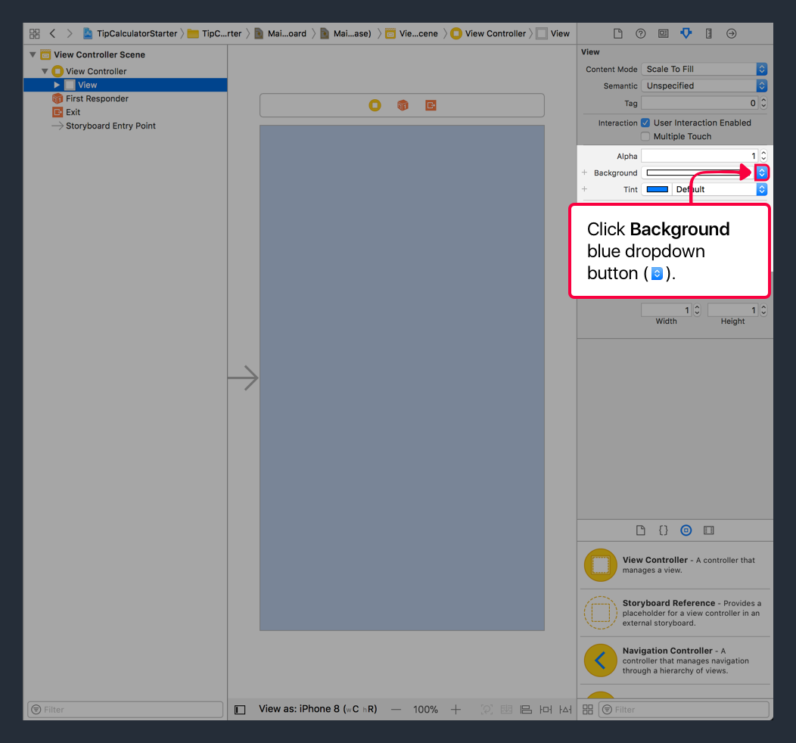

We'll start building our app by creating the UI in _Interface Builder_. For reference, here are the tip calculator designs:

# Creating Views

We'll get started by creating our custom top (navigation) bar with a `UIView`.

> [info]
`UIKit` has it's own top bar called the `UINavigationBar`. To keep things simple, we'll create our own custom navigation bar. From here, if we refer to the `navigation bar`, then we're refering to our custom top bar.

<!-- break -->

> [action]
Open `Main.storyboard` from your project navigator. You should see your single view controller. 

Next, we'll add a `UIView` and reposition/resize it to be our custom navigation bar.

> [action]
Create a custom navigation bar by dragging an `UIView` object to your view controller and dragging it to the top of the view controller.
>

It's a little hard to see now because our custom navigation bar and our view controller's root view are both white. Let's add a little constrast so both views are easier to see.

> [action]
Change the view controller's root view to off-white:
>
1. Select the view controller's root view by either clicking on it's storyboard UI or selecting it in the document outline. 
1. Open the _Attributes Inspector_ in the _Utilities area_. 
1. Next, click on the color name or blue dropdown button beside the active color for the `Background Color` field. 
1. Finally, select the `Off-White` color under the _Named Colors_ subheader in the dropdown menu.

introduction to layout and ui

start by creating basic blocks with just preset frames
  explain coordinate system, frame, bounds
  what are problems with just using frames?
  show some problems of using devices with different sizes

introduce auto-layout and describes how it solves this problem
  show how you can see how auto-layout changes constraints in different devices without running on simulator
  example of auto-layout
  take care of layout for 4 main groups
  next move inside to deal with subviews for each group

header

tip input
  using auto-layout
  using stack views

tip output
  challenge using stack views

- coordinates, frames and bounds
- why we need auto-layout
- introducting stackviews
- auto-layout vs stack views

