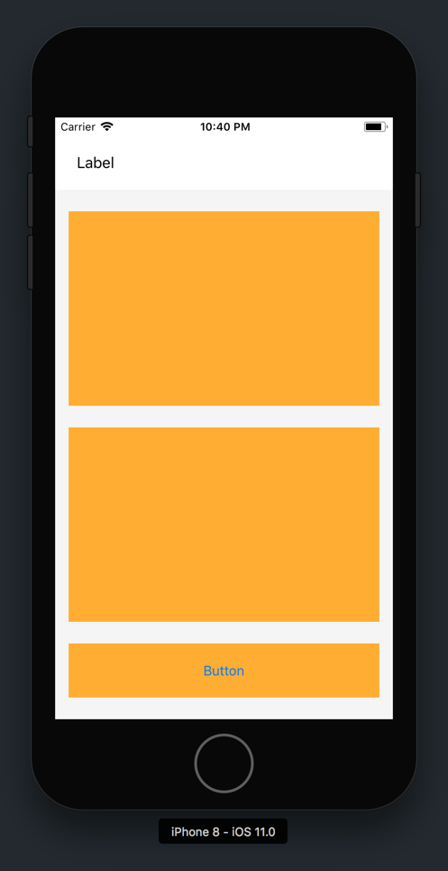
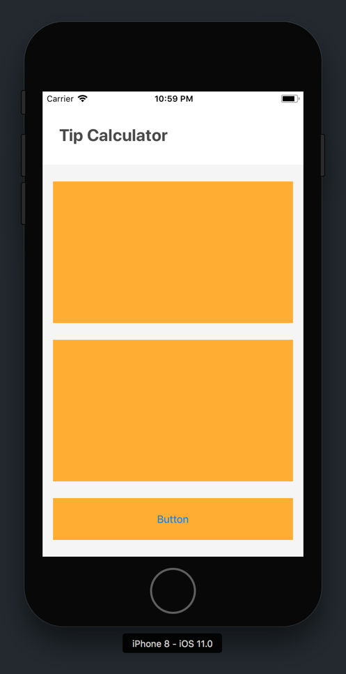
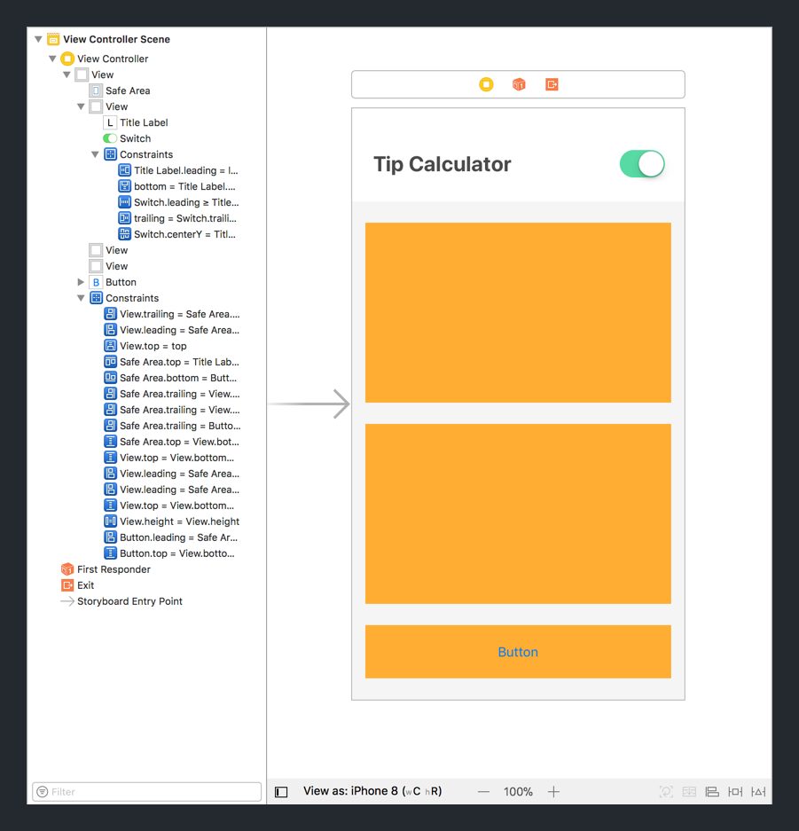
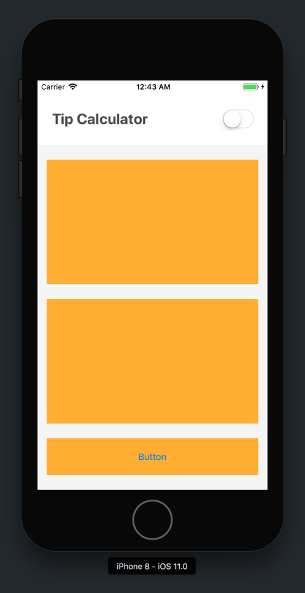
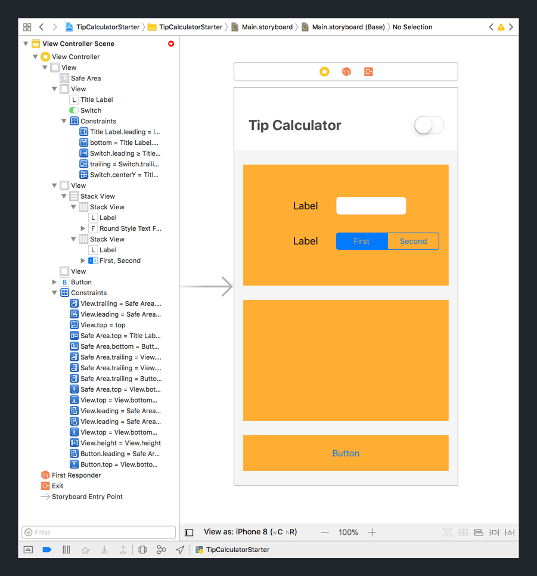
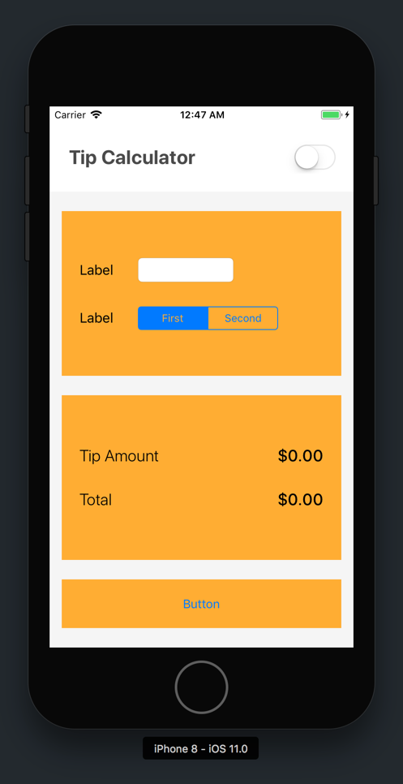

In the previous section, we've built a skeleton of the main scaffolding of our UI.


In this section, we'll finish implementing each of our _view groups_:

1. Custom Navigation Bar
1. Tip Input Card
1. Tip Output Card
1. Reset Button

For each group, we'll need to:

1. Add the correct UIKit objects
1. Identify and set _auto-layout_ constraints for each view object
1. Create the appropriate `IBOutlets` and `IBActions` for each view object

By implementing and connecting our UI, we'll set a strong foundation for implementing our future tip calculator code.

Let's get started by completing our navigation bar.

# Custom Navigation Bar

We've already build the base view of our custom navigation bar using a `UIView`. To finish our navigation bar, we'll need to first add the remaining subviews: a `UILabel` and `UISwitch`.


Let's start by adding the title label.

## Title Label

Before we add our title label in our storyboard, let's first think all of constraints we'll need to create our layout.

> [challenge]
Using the design below, identify each of the _auto-layout_ constraints for your title label.
>


<!-- break -->

> [solution]
Check that you have all of the necessary constraints for the title label:
>

>
Each of the constraints listed out:
- (Label) Top Edge 0pts from Safe Area Top Edge
- (Label) Leading Edge 24pts from Super View (Nav Bar) Leading Edge
- (Label) Bottom Edge 0pts from Super View (Nav Bar) Bottom Edge

After verifying that your title label constraints are correct, let's implement our new label in storyboard.

> [action]
Open storyboard and implement your navigation bar title label:

>
Let's break down the video step-by-step:
1. Drag a `UILabel` from the _Object Library_ on top of the custom nav bar view (`UIView`) in your view controller.
1. Add the constraints we previous identified to our label:
    - (Label) Leading Edge 24pts from Super View (Nav Bar) Leading Edge
    - (Label) Bottom Edge 0pts from Super View (Nav Bar) Bottom Edge
    - (Label) Top Edge 0pts from Safe Area Top Edge
    
We've successfully added the constraints to our navigation bar title label. 



Next, we'll style it with the correct attributes so it matches our design.

> [action]
In your storyboard, select your navigation bar's title label and open the _Attributes Inspector_ in the _Utilities area_. Using the _Attributes Inspector_, find each of the view object propertoes and change their values to the following:
    - Font: `System Bold 24.0`
    - Font Color: `tcCharcoal`
    - Text: `Tip Calculator`
    
After you're done, your new title label should look like the following:



Next, let's move on to our `UISwitch`:

## Light/Dark Mode (Theme) Switch

We'll finish our navigation bar by implementing our switch. Again, let's start by figuring out all of the constraints we'll need for our `UISwitch`.

> [challenge]
Using the design below, identify each of the _auto-layout_ constraints for your switch.
>


<!-- break -->

> [solution]
For our `UISwitch`, we'll need the following the constraints:

>
Each of the constraint listed:
    - (Switch) Trailing Edge 24pts from Super View (Nav Bar) Trailing Edge
    - (Switch) Center aligned with Label Center
    - (Switch) Leading Edge ≥20pts from Label Trailing Edge

Next, we'll add our switch and it's constraints in storyboard.

> [action]

>
1. Drag a `UISwitch` from the _Object Library_ to your view controller.
1. Size and position so that it looks relatively correct (we'll add constraints next but this will make it easier)
1. Add the following constraints to your `UISwitch`
    - (Switch) Trailing Edge 24pts from Super View (Nav Bar) Trailing Edge
    - (Switch) Leading Edge ≥20pts from Label Trailing Edge
    - (Switch) Center aligned with Label Center (Remember, you'll need to select the switch and ctrl-drag to the label.)

Before moving on, let's configure the `Tint Color` attribute of our switch.

> [action]
In your `Main.storyboard`, select your switch and open the _Attributes Inspector_. 
>
In the _Attributes Inspector_ pane, find and change the following attributes:
    - State: `Off`
    - On Tint: `tcSeafoamGreen`
>


## Adding Our IB Connections

We've almost finished building our custom navigation bar. Before we move on to our tip input card, we'll need to make our `IBOutlets` and `IBActions` so that we can interact with our storyboard objects with code.

For review, `IBOutlets` create a reference in our view controller so that we can write code that interacts with our `UILabel` and `UISwitch` objects. We'll need this later to implement our tip calculator logic for theming.

First, let's create a `IBOutlet` for our title label.

> [action]

>
1. Locate your `ViewController.swift` file in your _Project Navigator_.
1. Hold down the _Option_ button and click on your `ViewController.swift` file in the _Project Navigator_. You should see your `ViewController.swift` file open the _Assistant Editor_.
1. (Optional) Use your Xcode toolbar to hide the _Utilities area_ to create more space in your project.
1. Hold down the _Control_ (ctrl) button. Then, click and drag from the title label in your `Main.storyboard` to your `ViewController.swift` class in your _Assistant Editor_.
1. After you let go, you should see a popup prompt to set details for your `IBOutlet`. Name your new `IBOutlet` the following: `titleLabel`.

Next, we'll create an `IBAction` for our `UISwitch`. Remember `IBAction` can be triggered by `UIControlEvents`. In our case, we'll be able to trigger an event whenever the switch is trigggered.

> [action]
Let's create an `IBAction` for our switch:
![Nav Bar Switch IBAction]
>
To create our _IBAction_ in the video above:
1. Locate your switch in your storyboard view controller.
1. Hold down the _Control_ (ctrl) button. Then, click and drag from the switch in your `Main.storyboard` to your `ViewController.swift` class in your _Assistant Editor_.
1. After you let go, you should see a popup prompt to set details for your `IBOutlet`. Using the _Connection_ dropdown, set the _Connection_ type to `Action`.
1. Next, name your action `switchValueChanged` and set the _Type_ from `Any` to `UISwitch`.
1. Finally, click `Connect` to create your new _IBAction_.

> [info]
It's possible to abstract our navigation into a custom view object. In larger projects, creating custom view objects can make different view components re-usable and easier to use. However, we won't worry about this topic in this tutorial (to keep things simple.)

We've now finished building out the UI for our custom navigation bar. Now that you're done, your UI should look like this:



> [action]
Build and run your app. If everything has gone well, you should see the following:
>


# Input Card View

Next, we'll move onto the same process for our input card view. First let's review our design for our input card:


In our input card view, we'll need to add two labels for each respective user input in addition to our text field and segmented control.

To add constraints to the subviews on our tip input card, we'll introduce a new layout tool called: `UIStackView`.

## Stack Views

`UIStackView` allow us to create horizontal or vertical stacks of views. This can be especially useful for easily organizing the layout of elements without need to use a complex set of constraints.


For our case, we'll use stack views to easily group our input subview objects.

Our first `UIStackView` will group together our first label and it's respective text field.


> [action]
Create a stack view using your first label and it's respective text field.
>

>
In the video above, we do the following:
1. Drag a `UILabel` from the _Object Library_ onto the input card view.
1. Drag a `UITextField` from the _Object Library_ onto the input card view.
1. Make sure both objects are positioned side-by-side horizontally. The relative positioning will determine the _Axis_ of the stack view (horizontal or vertical.)
1. Select your new label. While your label is still selected, hold down shift and click on the text field to select both subviews. 
1. With both label and text field selected, click the `Embed In Stack` button to create a new stack view. The `Embed In Stack` button is in the bottom-right corner of the _Editor area_.
>
Next, we'll need to configure some of our subview attributes.
>
1. In your _Document Outline_, select your stack view. With your selected stack view, navigate to the _Attributes Inspector_ in the _Utilities area_. 
1. In the _Attributes Inspector_, find the _Spacing_ field and change it's value from `0` to `30`.
>
Finally, we'll set a width constraint for our text field.
>
1. Expand the stack view object in your _Document Outline_ and select the `UITextField` object.
1. With the text field selected, click the `Add New Constraints` button.
1. Set a width constraint of `118` for the text field.

Great! We've finished our first stack view. We'll need to create a second on for our second grouping of user input.


> [action]
Create a stack view using another label and a segmented control:
>

>
In the video above, we do the following:
>
1. Drag a `UILabel` from the _Object Library_ onto the output card view.
1. Drag a `UISegmentedControl` from the _Object Library_ onto the output card view.
1. Make sure both objects are positioned side-by-side horizontally. The relative positioning will determine the _Axis_ of the stack view (horizontal or vertical.)
1. Select your _Tip Percent_ title label. While your label is still selected, hold down shift and click on the segmented control to select both subviews. 
1. With both label and segmented control selected, click the `Embed In Stack` button to create a new stack view. The `Embed In Stack` button is in the bottom-right corner of the _Editor area_.
>
Again, we'll need to configure our stack view _Spacing_.
>
1. In your _Document Outline_, select your stack view. With your selected stack view, navigate to the _Attributes Inspector_ in the _Utilities area_. 
1. In the _Attributes Inspector_, find the _Spacing_ field and change it's value from `0` to `30`.
>
Also, we'll set a width constraint for our segmented control.
>
1. Expand the stack view object in your _Document Outline_ and select the `UISegmentedControl` object.
1. With the segmented control selected, click the `Add New Constraints` button.
1. Set a width constraint of `173` for the segmented control.

Next, we'll create a vertical stack view from our two horizontal stack views.

> [action]
Create a vertical stack view using the two existing stack views: bill amount stack view and tip percent stack view.
>

>
To create our vertical stack view we:
1. Select both previous stack views in the _Document Outline_.
1. With both horizontal stack views selected, click the `Embed In Stack` button to create a new stack view.
1. (Optional) You can expand the super stack view to see the previous stack views and each of thier respective elements.
>
Before moving on, set the _Spacing_ attribute on your new vertical stack view:
1. Select your vertical stack view. 
1. With your vertical stack view selected, open the _Attributes Inspector_.
1. Locate and change the _Spacing_ attribute from `0` to `35`

`UIStackView` is a useful tool that automatically generates layout constraints for each of the stack view's subviews.

<!-- TODO: maybe talk more about stack view, what it is, what it does and it's properties (subview array) -->

Your tip input card view should now look like the following:



> [info]
In this section, we used stack views to implement our layout. It's also possible to just use auto-layout constraints, but that would require a lot more work. Try to think of the constraints you'd need to use create the same layout. Stack views are especially useful turning layouts that require a complex set of constraints into groups of `UIStackView` objects that apply constraints to all of the subviews within the stack view automatically.

Finally, we'll need to center our stack view without our input card view. We can use the set in container view constraint for this task.

> [action]
Center your vertical stack view within your input card view: 
>
In the video above, we add constraints to our input card (outer) stack view:
1. Select the outer stack view in your _Document Outline_.
1. With your outer stack view selected, add the following constraints:
- (Outer Stack View) Leading 22pts from Super View (Input Card View) Leading Edge
- (Outer Stack View) Trailing 22pts from Super View (Input Card View) Trailing Edge
- (Outer Stack View) Center Vertically within Super View (Input Card View)

## Adding Our IB Connections

Last, to complete this group, we'll also need to add our `IBOutlets` and `IBActions`.

> [action]
Create the following `IBOutlets` and `IBAction` for each of the views in the tip input card:
1. IBOutlet: Tip Input Card View (`UIView`) with name `inputCardView`.
1. IBOutlet: Bill Amount Text Field (`UITextField`) with name `billAmountTextField`
1. IBOutlet: Tip Percent Segmented Control (`UISegmentedControl`) with name `tipSegmentedControl`
1. IBAction: For `Value Changed` event with method name `tipPercentageChanged`


<!-- TODO: add custom textfield, but don't do that here -->

# Output Card View

We'll implement our layout similar to the way we implemented our input card view subviews: with stack views.


> [challenge]
Implement the output card views and constraints based on the design about. If you get stuck, you can reference the previous steps or peek at the solution.
>
Hint: It helps if you follow the process of: 
1. Identify the view objects you'll need.
1. Think about which constraints and/or stack views you'll need to use.
1. Configure view or stack view attributes.
1. Create the necessary IBOutlets and/or IBActions.

<!-- break -->

> [solution]
First let's create our stack views from the proper view elements: 
>
To create each of our stack views:
1. Drag two labels from the _Object Library_ side-by-side.
1. Select both labels and create a stack view using the `Embed In Stack` button.
1. Select your stack view and set the _Spacing_ attribute to `30` using the _Attributes Inspector_.
1. Repeat the steps above again to create another identical stack view right below.
1. Next, use the _Document Outline_ to select both stack views. With both stack views selected, create a new stack view using the `Embed In Stack` button.
1. Select the outer stack view and set the _Spacing_ attribute to `30` using the _Attributes Inspector_.
>
Next, we'll add constraints to position our outer stack view:

>
You can create your output card view with the following steps:
1. Select the outer stack view in the _Document Outline_.
1. With your outer stack view selected, add the following constraints:
- (Outer Stack View) Leading 22pts from Super View (Input Card View) Leading Edge
- (Outer Stack View) Trailing 22pts from Super View (Input Card View) Trailing Edge
- (Outer Stack View) Center Vertically within Super View (Input Card View)

<!-- TODO: Last, select each of the stack views and set equal width. -->


## Setting Label Attributes

We need to set the attributes for each respective label.

For both of the title labels on the left side, set the following attributes:
1. Font: `System Light 20.0`
1. Alignment: `Left`
1. Text: `Tip Amount` (1st Label) and `Total` (2nd Label)
`
For both of the on the right side, set the following attributes:
1. Font: `System Medium 20.0`
1. Alignment: `Right`
1. Text: `$0.00`

<!-- TODO: set horizontal content hugging priority for both right labels -->

## Adding Our IB Connections

Last, to complete this group, we'll also need to add our `IBOutlets` and `IBActions`.

> [action]
Create the following `IBOutlets` and `IBAction` for each of the views in the tip output card:
1. IBOutlet: Tip Output Card View (`UIView`) with name `outputCardView`.
1. IBOutlet: Tip Amount Title Label (`UILabel`) with name `tipAmountTitleLabel`
1. IBOutlet: Tip Amount Label (`UILabel`) with name `tipAmountLabel`
1. IBOutlet: Total Title Label (`UILabel`) with name `totalTitleLabel`
1. IBOutlet: Total Cost Label (`UILabel`) with name `totalCostLabel`

When finished, build and run your app. This is what your app should look like this far.



# Reset Button

We won't need to add any subviews to our reset button. Instead, we'll just need to configure some of our button's attirbutes using the _Attributes Inspector_ and create it's respective IB connections.

First, let's configure our button's style.

> [action]
Select the button in your storyboard and open the _Attributes Inspector_. Change the following attributes:
    - Type: `Custom`
    - Background Color: `tcDarkBlue`
    - Font: `System Bold 13.0`
    - Title: `RESET`

## Creating IB Connections

Next, we'll need to create our IB connections.

> [action]
Create the following `IBOutlets` and `IBAction` for your reset button:
1. IBOutlet: Reset Button (`UIButton`) with name `resetButton`
1. IBAction: For `Touch Up Inside` event with method name `resetButtonTapped`

Now let's test that it's working. 

> [action]
Put a print statement in your `resetButtonTapped` function to test that it's working:
>
```
@IBAction func resetButtonTapped(_ sender: UIButton) {
    print("reset button tapped")
}
```

Build and run. If working successfully, when you tap the reset button, you should be able to see the following:


# Conclusion

Although we're not completely done with our styling, we'll first implement our logic for our tip calculator. In this section, we implemented Let's move onto the next section.

<!-- below is scaffolding; remove before production -->

# Dealing Layers (maybe move this to another section)
## shadows
## rounded corners


maybe move this to next section
  - add shadow to nav bar
  - add rounded corners to cards and button


