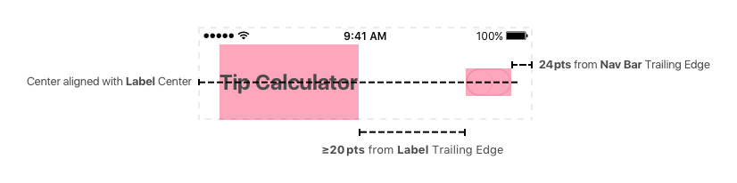
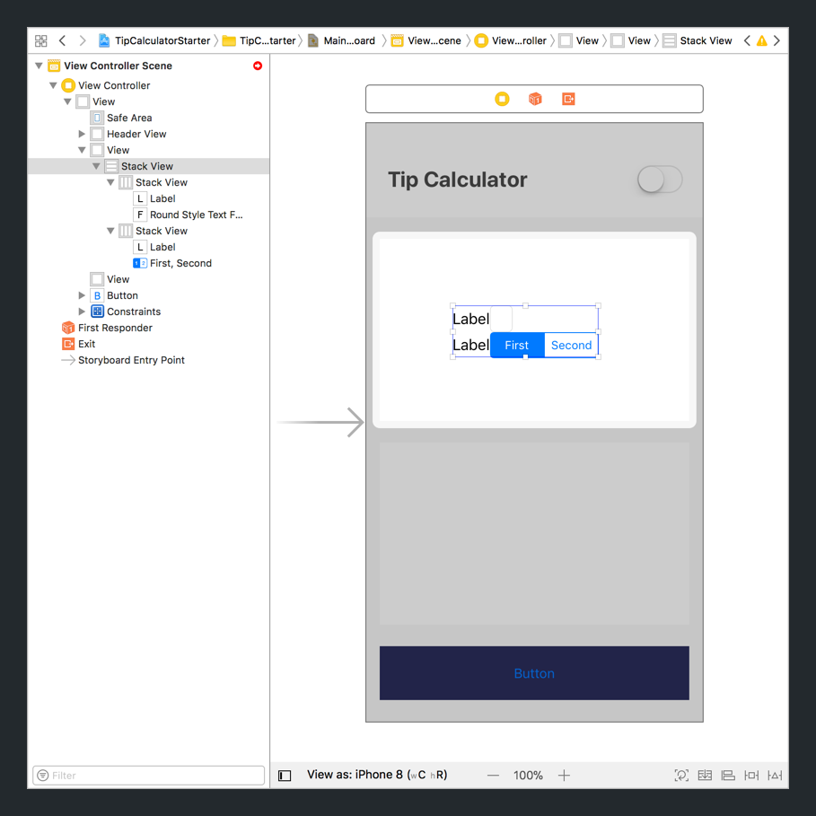

In the previous section, we implemented a skeleton of each of the UI groups in storyboard. If you build and run your project, your app should look like the following:


In this section, we'll finish building each of our _view groups_:

1. Header
1. Tip Input Card
1. Tip Output Card
1. Reset Button

To finish implementing each of our _view groups_, we'll need to the process below:

1. Add each of the correct `UIKit` objects
1. Identify and set _auto-layout_ constraints for each subview
1. Configure each subview's attributes to match the designs
1. Create the appropriate `IBOutlets` and `IBActions`

Let's start by finishing the first UI group: our header.

# Header View

In our previous step, we've already added a base view (`UIView`) for our header. In it's current state, our header view looks like the following:


To finish implementing our header view, we'll need to identify and add the remaining subviews.

> [challenge]
Using the design below, can you identify the views we'll need to finish building the UI for our header view?
>


<!-- break -->

> [solution]
We'll need the following view objects to build our header:
>
- `UILabel`: title label
- `UISwitch`: theme color switch

After identifying both of the view objects we'll need to add, we'll need to add them and set each of their respective constraints. Let's start with the title label!

## Title Label

### Identifying Constraints

Before we starting adding constraints in storyboard, let's take a step back and think of all the constraints we'll need for our title label.

> [challenge]
Using the design below, identify each of the _auto-layout_ constraints for your title label. Write each of the constraints down on a sheet of paper.
>
Hint: the red area represents the frame of the label.
>


Check your answer with the solution below.

> [solution]
Based on our design, our label will need the following constraints:
>

>
**Constraints**:
>
- (Label) Leading Edge 24pts from Super View (Header View) Leading Edge
- (Label) Bottom Edge 0pts from Super View Bottom Edge
- (Label) Top Edge 0pts from Safe Area Top Edge

### Adding Constraints

After identifying our constraints, we can use _Interface Builder_ to add our new `UILabel` and it's constraints.

> [action]
Open `Main.storyboard` and implement your title label and it's constraints:
>

>
Step-by-step:
>
1. Drag a `UILabel` from the _Object Library_ and drop it on top of your header view (`UIView`).
1. With your new `UILabel` selected, click the `Add New Constraints` button.
1. Add the following first two constraints using the `Add New Constraints` popup:
    - (Label) Leading Edge 24pts from Super View Leading Edge
    - (Label) Bottom Edge 0pts from Super View Bottom Edge
1. To add the final constraint, select your `UILabel` in the _Document Outline_.
1. With your `UILabel` selected, hold control (ctrl) and click-drag to the _Safe Area_ object in the _Document Outline_.
1. You should see a popup to add a new constraint. Select `Vertical Spacing`. Wait a second, our new `Vertical Spacing` constraint isn't not properly configured.
1. Hover over the new `Vertical Spacing` and click on it. You should see it's attributes appear in the _Attributes Inspector_.
1. In the _Attributes Inspector_, change the constraint's attributes:
    - _Second Item_: Change from `Label.Bottom` to `Top`
    - _Constant_: Change from `-85` to `0`

<!-- break -->

> [info]
Identifying and setting the _auto-layout_ constraints for each view object can be tricky for newbies. If you find yourself struggling, slow down and try to break down your layout problem into smaller chunks. As you continue to practice, working with constraints will become easier and easier.

Nice! We've added a title label to our header. If you build and run your project, you'll see the following:


But... it's still off. Our title label still doesn't look like our final design.

That's because we'll need to use the _Attribute Inspector_ to set the `UILabel` attributes to match our designs.

### Configuring Attributes

> [action]
In `Main.storyboard`, select your header view's title label. Navigate to the _Attributes Inspector_ in the _Utilities area_ and change the following attributes:
>
- _Text_: Change from `Label` to `Tip Calculator` 
- _Font_: Change from `System 17.0` to `System Bold 24.0` 
- _Font Color_: Use the blue dropdown to change from `Default` to `tcCharcoal` 

After configuring each of the attributes above, your title label should look like the following:


Looks pretty good huh? Let's move on to our `UISwitch`.

## Light/Dark Mode (Theme) Switch

Identify constraints. Add object and set constraints. Configure attributes. Rinse. Repeat.

We'll going to repeat this process many times before this tutorial is over. Get used to this, as it's the same process you'll need to use if when you're building your own apps.

Let's start by identifying the constraints needed for our `UISwitch`.

### Identifying Constraints

> [challenge]
Using the design below, identify each of the _auto-layout_ constraints for your theme switch. Write each of the constraints down on a sheet of paper.
>
Hint: the red area represents the frame of the switch.
>


Check your answer with the solution below.

> [solution]
Based on our design, our `UISwitch` will need the following constraints:
>

>
**Constraints**:
>
- (Switch) Trailing Edge 24pts from Super View (Header View) Trailing Edge
- (Switch) Leading Edge ≥20pts from Label Trailing Edge
- (Switch) Center vertically aligned with Label Center

### Adding Constraints

Let's go ahead and add these constraints to our `UISwitch`.

> [action]
Open `Main.storyboard` and implement your `UISwitch` and it's constraints:
>

>
Step-by-step:
>
1. Drag a `UISwitch` from the _Object Library_ and drop it next to your header title label.
1. With your  `UISwitch` selected, click the `Add New Constraints` button.
1. Add the following two constraints using the `Add New Constraints` popup:
    - (Switch) Trailing Edge 24pts from Super View Trailing Edge
    - (Switch) Leading Edge 20pts from Label Trailing Edge
1. Hover over the switch's leading edge constraint to the label and click on it. You should see it's attributes appear in the _Attributes Inspector_.
1. Using the _Attributes Inspector_, change the constraint's _Relation_ attribute from `Equal` to `Greater Than or Equal`.
1. Click on the `UISwitch` to select it again. (Make sure you're not selecting the constraint from the previous step.)
1. With your switch selected, hold control (ctrl) and click-drag from the `UISwitch` to the `UILabel`.
1. You should see a popup to add a new constraint. Select `Center Vertically` to vertically align your switch's center to the label's center.

Nice! We've added and set our constraints for our `UISwitch`. Now, let's configure the switch's attributes.

### Configuring Attributes

> [action]
In `Main.storyboard`, select your header view's switch. Navigate to the _Attributes Inspector_ in the _Utilities area_ and change the following attributes:
>

>
**Attributes:**
>
- _State_: Change from `On` to `Off`
- _On Tint_: Change from `Default` to `tcSeafoamGreen`

When you're done, your custom header view should look like the following:


## Adding Our IB Connections

We're almost finished with implementing our first UI group! To finish up, we'll need to create our `IBOutlets` and `IBActions`.

`IBOutlets` and `IBActions` allow our Swift code receive events and interact with our storyboard views.

`IBOutlets` create an instance variable that we can reference in our Swift code. This allows us interact with our title label and switch programmatically.

`IBActions` create a function that will execute code when triggered. These functions are triggered by user interaction with your UI elements. A common example is a user tapping a button. When the button is tapped, it triggers an `IBAction` that will run any code within it's corresponding function.

We'll need both of these connections later to implement our tip calculator logic.

Let's get started by creating our first `IBOutlet` for our header view (`UIView`.)

> [action]
Open your `Main.storyboard` and `ViewController.swift` files side-by-side using the _Assistant Editor_:
>

>
To create IB connections, we'll need to first open our storyboard and view controller source code side-by-side:
>
1. Open your `Main.storyboard` in your main editor.
1. Hold down the option button and click on `ViewController.swift` file in your _Project Navigator_. This will open your view controller in your _Assistant Editor_.
1. (Optional) Use your Xcode toolbar to hide the _Utilities area_ to create more space in your project.

With our `Main.storyboard` and `ViewController.swift` files side-by-side, let's create an `IBOutlet` for our header.

> [action]
Create an `IBOutlet` for your header called `headerView`:
>

>
Step-by-step:
>
1. Select your header view (`UIView`) in the _Document Outline_.
1. With your header view selected, hold down ctrl and click-drag from the header view in your _Document Outline_ to your Swift code within the `ViewController` class definition.
1. You should see a popup for creating a new IB connection. Set the name field as `headerView`.
1. Click _Connect_ to create your new `IBOutlet`.

You should see a new `IBOutlet` instance variable in your `ViewController` class:

```
class ViewController: UIViewController {

    @IBOutlet weak var headerView: UIView!

    // MARK: - View Lifecycle

    override func viewDidLoad() {
        super.viewDidLoad()
    }
}
```

As you can see, we can now reference our header view as `headerView` in our Swift code.

Awesome! Repetition is the mother of learning. Let's do it again.

> [action]
Create an `IBOutlet` for your header view's title label called `titleLabel`:
>

>
Step-by-step:
>
1. Select your title label (`UILabel`) in your storyboard view controller.
1. With your Tip Calculator label selected, hold down ctrl and click-drag from the label to your Swift code within the `ViewController` class definition.
1. You should see a popup for creating a new IB connection. Set the name field as `titleLabel`.
1. Click _Connect_ to create your new `IBOutlet`.

<!-- break -->

> [info]
Notice that last time we created an `IBOutlet` by ctrl-dragged from our header view in the _Document Outline_. This time we created our `IBOutlet` by ctrl-dragged directly from the label's storyboard object. Both ways of creating `IBOutlets` are valid.

At this point, we've walked through creating an `IBOutlet` twice. It's your turn.

> [challenge]
Create an `IBOutlet` for your `UISwitch` named `themeSwitch`. If you get stuck, go back and reference the steps we used to create the previous two `IBOutlets`.

<!-- break -->

> [solution]
After creating an `IBOutlet` for your switch, your `ViewController.swift` file should look like the following:
>
```
class ViewController: UIViewController {
>
    @IBOutlet weak var headerView: UIView!
    @IBOutlet weak var titleLabel: UILabel!
    @IBOutlet weak var themeSwitch: UISwitch!
>
    // MARK: - View Lifecycle
>
    override func viewDidLoad() {
        super.viewDidLoad()
    }
}
```

After checking your solution, let's move on to creating our first `IBAction`.

We'll need to create an `IBAction` for our switch. This will allow us to execute code each time our switch is toggled from off to on and vice versa.

> [action]
Open both your `Main.storyboard` and `ViewController.swift` file using the _Assistant Editor_. Create a new `IBAction` for your switch:
>

>
Step-by-step:
>
1. Select your switch (`UISwitch`) in the _Document Outline_.
1. With your switch selected, hold down ctrl and click-drag from the switch in your _Document Outline_ to your `ViewController` class.
1. You should see a popup for creating a new IB connection. In the popup, change the _Connection_ type from `Outlet` to `Action`. Changing this property allows us to create a different type of IB connection.
1. Set the name of our action as `themeToggled`.
1. Change the _Type_ property from `Any` to `UISwitch`.
1. Make sure the _Event_ property is set as `Value Changed`. If not, use the dropdown to set it to `Value Changed`.
1. Click _Connect_ to create your new `IBAction`.

<!-- break -->

> [info]
After creating your switch's `IBAction`, you can close the _Assistant Editor_. If don't have a lot of screen space, it's helpful to open and close the _Assistant Editor_ as you need it.

Let's give our new `IBAction` a test run to see that it's working correctly.

> [action]
Open `ViewController.swift` from your _Project Navigator_ and add the following code in your `themeToggled` function:
>
```
@IBAction func themeToggled(_ sender: UISwitch) {
    if sender.isOn {
        print("switch toggled on")
    } else {
        print("switch toggled off")
    }
}
```

After adding the code above we can test our `IBAction`.

> [action]
Build and run your project. Toggle your switch on and off a couple of times. If you look at your Xcode _Debugger area_ you should see the following print statements in your console each time you toggle your switch:
>


We've finished implementing the UI and IB connections for our header view. Side-by-side, your `Main.storyboard` and `ViewController.swift` files should look like the following:


If you build and run your project, you app should look like:


If you're looking for more practice, good news! We'll need to repeat the same steps again for our input card, output card and reset button views. Onwards!

> [info]
As you get more advanced, you'll learn about creating custom view objects that abstract all of it's subview components. Creating custom views makes your custom views re-usable and decouples your code. This is a little more advanced and out of the scope of this tutorial.

# Input Card View

The next UI group we'll complete is our input card. Let's take another look at our design:


For our input card, we'll need to add the following UI components:


We'll need two labels, a text field, and a segmented control. Next, let's think about how to use _auto-layout_ to build our design.

## Identifying Constraints

To build our header view, we used constraints to create our dynamic view layout. This time, we'll introduce a new tool called `UIStackView`.

### Stack Views

`UIStackView` allows us to create horizontal or vertical stacks of views. This is especially useful for easily organizing rows or columns layouts.

Let's take a look at what that looks like:


In both cases, you can see that each stack view contains multiple subviews. The `UIStackView` automatically handles calculating the frame of each subview within it.

We'll use stack views to easily layout our input subviews without having to add the constraints ourselves.

Let's look at how we'll use a horizontal stack view to group our first row of views.


As you can see, both our _Bill Amount Title Label_ and _Bill Amount Text Field_ are added to a single `UIStackView`. The purple area in the image above shows the stack view's frame.

Similarly, we can use another horizontal stack view to layout our _Tip Percent Title_ and _Tip Segmented Control_ subviews. Let's look at what the would look like:


Each `UIStackView` calculates the frame of each subview within it. However, we'll still need to somehow define the frame of each `UIStackView`.

To position both of our horizontal stack views in the center of our input card, we'll use our existing knowledge of stack views and constraints.

First, we'll add a vertical stack view containing both horizontal stack views:


Next, we'll use constraints to dynamically center the outer stack view:


We add the following constraints to our outer stack view:

- (Outer Stack View) Leading Edge 22pts from Super View (Input Card) Leading Edge
- (Outer Stack View) Trailing Edge 22pts from Super View Trailing Edge
- (Outer Stack View) Center vertically aligned with Super View Center

We'll need to add a few more width constraints to guarantee each view is of the correct width.

We'll start by adding an equal width to both inner (horizontal) stack views:


In the image above, we add the following two constraints:

- (Inner Top Stack View) Equal Width to Outer Stack View Width
- (Inner Bottom Stack View) Equal Width to Outer Stack View Width

As the name suggests, these two _Equal Widths_ constraints define the widths of the inner stack view to be the same as the outer stack view.

Last, we need to add a width constraint for our `UITextField` and `UISegmentedControl` respectively.


Our width constraints:

- (Bill Amount Text Field) 118pts Width
- (Tip % Segmented Control) 173pts Width

Whew! Those are the final constraints we'll need for our input card.

As you can see, the combination of stack views and constraints give developers a lot of power to create complex UI layouts.

Now that we've figured how we're going to implement the layout for our input card, let's start building!

## Adding Constraints

As you can see, the layout for our input card is pretty complex. To make things easier, we'll break our implementation into smaller steps.

We'll start with the inner top stack view: the _Bill Amount Stack View_.

### Bill Amount Stack View

First, we'll need to add our stack view's sub-elements.

> [action]
In `Main.storyboard`, add an `UILabel` and `UITextField` to your view controller:
>

>
Step-by-step:
>
1. Drag a `UILabel` from the _Object Library_ and drop it on top of your input card view (`UIView`).
1. Drag a `UITextField` from the _Object Library_ and position it next to your previous label.
1. Make sure both subviews are positioned horizontally side-by-side. This will be important when we create our stack view.

Next, let's create our first `UIStackView` from our two new views.

> [action]
Create the _Bill Amount Stack View_ using the label and textfield:
>

>
1. Select your _Bill Amount Title Label_ (`UILabel`) in your storyboard.
1. Hold down shift and click on your `UITextField`. This allows you to select multiple items at the same time.
1. With both label and text field selected, click on the `Embed In Stack` button near the `Add New Constraints` button. It's located in the bottom right corner of your _Editor area_.
1. (Optional) If you look in your _Document Outline_, you can see your new `UIStackView`. If you expand your stack view in your _Document Outline_ you can see each of the stack view's subviews.

Your storyboard should look like the following:


Needs some work huh? We won't worry about the styling yet. Let's move onto creating the inner bottom stack view.

### Tip Percent Stack View

First, we'll add the _Tip Percent Stack View's_ subviews.

> [action]
In `Main.storyboard`, add an `UILabel` and `UISegmentedControl` to your view controller:
>

>
Step-by-step:
>
1. Drag a `UILabel` from the _Object Library_ and drop it below the first label.
1. Drag a `UISegmentedControl` from the _Object Library_ and position it so that it's next to the new label and below the text field.
1. Make sure both label and segmented control are positioned horizontally side-by-side. In addition, make sure that they're positioned below the previous stack view.

Now we'll move on to create our second inner stack view.

> [action]
Create the _Tip Percent Stack View_ using the label and segmented control:
>

>
1. Select your _Tip Percent Title Label_ (`UILabel`) in your storyboard.
1. Hold down shift and click on your `UISegmentedControl`. This allows you to select multiple items at the same time.
1. With both label and segmented control selected, click on the `Embed In Stack` button near the `Add New Constraints` button. It's located in the bottom right corner of your _Editor area_.
1. (Optional) If you look in your _Document Outline_, you can see your new `UIStackView`. If you expand your stack view in your _Document Outline_ you can see each of the stack view's subviews.

Your storyboard should look like the following:


Both stack views should still be unstyled. We'll get to that once we finish adding all our constraints.

Next, let's create our outer stack view.

### Outer Stack View

> [action]
Create the _Outer Stack View_ using both inner (horizontal) stack views:
>

>
Step-by-step:
>
1. Collapse both inner stack views in the _Document Outline_.
1. Select any inner stack view in the _Document Outline_.
1. With the previous inner stack view selected, shift-click the other inner stack view to select both inner stack views simultaneously.
1. With both inner stack views selected, click on the `Embed In Stack` button.
1. (Optional) If you look in your _Document Outline_, you can see your new outer stack view and it's subviews.

Your storyboard should now look like the following:



With our inner and outer stack view constraints created, we'll need to add a few more constraints so _auto-layout_ can determine each stack view's frame.

Let's start with remaining outer stack view constraints.

> [action]
Set the outer stack view's frame with the following constraints:
>

>
Step-by-step:
>
1. Select the outer stack view in the _Document Outline_.
1. With your outer stack view selected, click the `Add New Constraints` button.
1. Add the following two constraints using the `Add New Constraints` popup:
    - (Outer Stack View) Leading Edge 22pts from Super View (Input Card) Leading Edge
    - (Outer Stack View) Trailing Edge 22pts from Super View Trailing Edge
1. In the _Document Outline_, hold down control (ctrl) and click-drag from the outer stack view to it's super view (input card).
1. In the popup, select `Center Vertically In Container` to create a new constraint. This will vertically align the outer stack view's center with it's super view's center.

Next, we'll add our equal width constraints to make sure the width of our outer and inner stack views are equal.

### Equal Widths Constraints

> [action]
Set equal widths constraints for each stack view:
>

>
Step-by-step:
>
1. Collapse both inner stack views in the _Document Outline_.
1. Select the outer stack view in the _Document Outline_.
1. With the outer stack view selected, shift-click the bottom inner stack view to select all three stack views simultaneously.
1. With all stack views selected, click the `Add New Constraints` button.
1. Select the `Equal Widths` checkbox and click `Add 2 Constraints` to create your equal width constraints.

Our progress so far:


Let's add our final width constraints for our text field and segmented control respectively.

### Fixed Width Constraints

> [action]
Set a width constraint for the _Bill Amount Text Field_:
>

>
Step-by-step:
>
1. Select the `UITextField` object in the _Document Outline_.
1. With the text field selected, click the `Add New Constraints` button.
1. Set a fixed width constraint of 118pts.

Finally, we'll need to add a fixed width constraint for our `UISegmentedControl`. Try to see if you can implement it by yourself.

> [challenge]
Add a width constraint for your _Tip Percent Segmented Control_ object. Set the width to 173pts. If you have trouble or get stuck, look at the previous example of adding a width constraint to our text field.

Check your solution below.

> [solution]
We set a width constraint for our _Tip Percent Segmented Control_ with the following:
>

>
Step-by-step:
>
1. Select the `UISegmentedControl` object in the _Document Outline_.
1. With the segmented control selected, click the `Add New Constraints` button.
1. Set a fixed width constraint of 173pts.

We've come a long ways from where we first started. We've finished adding all of our stack views and each view's constraints.


As you can see, our input card is starting to look more and more like our design. Next, we'll work on configuring our input card view attributes.

## Configuring Attributes

At this point, you should be familiar with setting the attributes of a storyboard object using _Interface Builder_.

We'll quickly go through one together for review and let you do the rest on your own.

### Input Card Background Color

> [action]
Set the _Input Card's_ background color to `tcDarkBlue`:
>

>
Step-by-step:
>
1. Select the input card view (`UIView`).
1. Open the _Attributes Inspector_ in the _Utilities area_.
1. Find the _Background_ attribute and use the blue dropdown button to change it's value from `White Color` to `tcDarkBlue`.

Now it's your turn.

> [challenge]
Set each of the following attributes for each respective element:
>
**Outer Stack View:**
>
- _Spacing_: Change from `0` to `35`
>
**Bill Amount Title Label (Inner Top Stack View):**
>
- _Text_: Change from `Label` to `Bill Amount`
- _Font_: Change from `System 17.0` to `System 20.0`
- _Color_: Change from `Default` to `tcWhite`
- _Alignment_: Change from `---` to `Left Aligned`
>
**Bill Amount Text Field (Inner Top Stack View):**
>
- _Alignment_: Change from `---` to `Center Aligned`
- _Placeholder_: Change from empty to `$0.00`
- _Correction_: Change from `Default` to `No`
- _Keyboard Type_: Change from `Default` to `Decimal Pad`
- _Keyboard Look_: Change from `Default` to `Light`
- _Tint_: Change from `Default` to `tcHotPink`
>
**Tip Percent Title Label (Inner Bottom Stack View):**
>
- _Text_: Change from `Label` to `Tip %`
- _Font_: Change from `System 17.0` to `System 20.0`
- _Color_: Change from `Default` to `tcWhite`
- _Alignment_: Change from `---` to `Left Aligned`
>
**Tip Percent Segmented Control (Inner Bottom Stack View):**
>
- _Segments_: Change from `2` to `3`
- _Tint_: Change from `Default` to `tcHotPink`

The last attribute we'll need to set is the title for each segment our segmented control.

> [action]
For each segment of your segmented control, set the title attribute to `15%`, `18%`, `20%` respectively:
>


Let's build and run our project to see our progress.


Bam! Our app matches our design (with exception of the rounded corners of course.)

> [info]
Rounded corners (and shadows) make use of our view's layer property. We'll cover this later in this tutorial.

Let's continue by creating the IB connections needed for our input card.

## Adding Our IB Connections

We've done this before with our header view. Let's get some more practice creating IB connections.

We'll do another together for review.

Let's create an `IBOutlet` for our input card (`UIView`.)

> [action]
Create an `IBOutlet ` for the input card view:
>

>
Step-by-step:
>
1. Open `Main.storyboard` in your _Editor area_.
1. Option-click on `ViewController.swift` in your _Project Navigator_ to open it in your _Assitant Editor_.
1. (Optional) Hide the _Utilities area_ to make more screen space for the _Assistant Editor_.
1. Select the input card view (`UIView`).
1. With your input card selected, hold down control and click-drag from the input card to your `ViewController` class.
1. In the popup, set the _Name_ field to `inputCardView` and click connect to create your new outlet.

<!-- break -->

> [challenge]
Now it's your turn to practice. If you find yourself stuck, look back on how we implemented our previous `IBOutlets` to refresh your memory.
>
Create the following `IBOutlets`:
>
- `UITextField` named `billAmountTextField`
- `UISegmentedControl` named `tipPercentSegmentedControl`

Finally, we'll need to create an `IBAction` for our segmented control.

> [challenge]
Try implementing an `IBAction` for your `UISegmentedControl`. Set the _Name_ as `tipPercentChanged` and check that the _Event type_ is `Value Changed`. If you get stuck, you can look back in the tutorial or check the solution (only if you're really stuck!)

<!-- break -->

> [solution]
Creating an `IBAction` is similar to creating an `IBOutlet`:
>

>
Step-by-step:
>
1. Select your segmented control (`UISegmentedControl`) in the _Document Outline_.
1. With your segmented control selected, hold down ctrl and click-drag from the segmented control in your _Document Outline_ to your `ViewController` class.
1. You should see a popup for creating a new IB connection. In the popup, change the _Connection_ type from `Outlet` to `Action`.
1. Set the name of our action as `tipPercentChanged`.
1. Change the _Type_ property from `Any` to `UISegmentedControl`.
1. Make sure the _Event_ property is set as `Value Changed`. If not, use the dropdown to set it to `Value Changed`.
1. Click _Connect_ to create your new `IBAction`.

When you're done, your storyboard and Swift code should look like the following:


If everything looks right, on to the next! If something's off, let's go back in the tutorial and make sure we didn't accidentally skip any steps.

<!-- TODO: add custom textfield, but don't do that here -->

# Output Card View

We've gone through the process of implementing each of our subviews for two of the four UI groups. We'll need to do it once again. This time we'll be more hands-off to give you practice doing it yourself.

Let's take another look at our design:


For our output card, we'll need to add the following UI components:


We'll need to add four new labels. Next, let's think about how we'll layout our views.

## Identifying Constraints

Similar to our input card, we'll use a combination of stack views and constraints to implement our layout.


First, we'll have two horizontal stack views:

- (Inner Top Stack View) _Tip Amount Title Label_ and _Tip Amount Label_
- (Inner Bottom Stack View) _Total Amount Title Label_ and _Total Amount Label_

Next, we'll create a outer (vertical) stack view from the two inner stack views.

Just like the input card's outer stack view, we'll add the following constraints to set the frame of the outer stack view:

- (Outer Stack View) Leading Edge 22pts from Super View (Output Card) Leading Edge
- (Outer Stack View) Trailing Edge 22pts from Super View Trailing Edge
- (Outer Stack View) Center vertically aligned with Super View Center

Finally, we'll add a few more constraints to make sure our subview widths are the correct size:

- (Inner Top Stack View) Equal Width to Outer Stack View Width
- (Inner Bottom Stack View) Equal Width to Outer Stack View Width
- (Tip Amount Title Label) 110pts Width
- (Total Amount Title Label) 110pts Width

> [info]
Look back on how we implemented the input card for more details if you're wondering why we've added any of the constraints.

## Adding Constraints

We've already had practice with using stack views and constraints. This time, try practicing on your own. If you get stuck, look back on how we implemented the layout for our input card.

> [challenge]
Create the inner top stack view with two `UILabel` views.

<!-- break -->

> [solution]
>
1. Drag two `UILabel` objects side-by-side from the _Object Library_.
1. Select both labels and create a horizontal stack view.

We'll also need to create the inner bottom stack view.

> [challenge]
Create the inner bottom stack view with two `UILabel` views.

<!-- break -->

> [solution]
>
1. Drag two `UILabel` objects side-by-side from the _Object Library_. Make sure both labels are below the previous stack view.
1. Select both labels and create a horizontal stack view.

Next, let's create our outer stack view.

> [challenge]
Create the _Outer Stack View_ using both inner (horizontal) stack views.

<!-- break -->

> [solution]
>
1. Collapse and select both inner stack views in the _Document Outline_.
1. With both inner stack views selected, click on the `Embed In Stack` button to create your outer stack view.

Your storyboard should now look like the following:


Next, let's add the constraints for our outer stack view.

> [challenge]
Set the outer stack view's frame with the following constraints:
>
- (Outer Stack View) Leading Edge 22pts from Super View (Output Card) Leading Edge
- (Outer Stack View) Trailing Edge 22pts from Super View Trailing Edge
- (Outer Stack View) Center vertically aligned with Super View Center

<!-- break -->

> [solution]
>
1. Select the outer stack view in the _Document Outline_.
1. With your outer stack view selected, click the `Add New Constraints` button.
1. Add the following two constraints using the `Add New Constraints` popup:
    - (Outer Stack View) Leading Edge 22pts from Super View (Input Card) Leading Edge
    - (Outer Stack View) Trailing Edge 22pts from Super View Trailing Edge
1. In the _Document Outline_, hold down control (ctrl) and click-drag from the outer stack view to it's super view (input card).
1. In the popup, select `Center Vertically In Container` to create a new constraint. This will vertically align the outer stack view's center with it's super view's center.

To finish up, we'll add the remaining width constraints.

> [challenge]
Set each of the width constraints for each respective view:
>
- (Inner Top Stack View) Equal Width to Outer Stack View Width
- (Inner Bottom Stack View) Equal Width to Outer Stack View Width
- (Tip Amount Title Label) 110pts Width
- (Total Amount Title Label) 110pts Width

<!-- break -->

> [solution]
To create both equal width constraints:
>
1. Collapse both inner stack views in the _Document Outline_.
1. Select the outer stack view in the _Document Outline_.
1. With the outer stack view selected, shift-click the bottom inner stack view to select all three stack views simultaneously.
1. With all stack views selected, click the `Add New Constraints` button.
1. Select the `Equal Widths` checkbox and click `Add 2 Constraints` to create your equal width constraints.
>
To create each title label's fixed width constraint:
>
1. Select the `UILabel` object in the _Document Outline_. Make sure you're selecting the correct label.
1. With the label selected, click the `Add New Constraints` button.
1. Set a fixed width constraint of 110pts.
1. Repeat the previous steps for the remaining title label.

Whew! That was a lot of work in a short time. Nice job! When you're finished adding all stack views and view constraints your storyboard should look like the following:


Next, we'll configure our output card view attributes so that it matches our designs.

## Configuring Attributes

> [challenge]
Set each of the following attributes for each respective element. Remember, if you get stuck you can look back to the previous steps in the tutorial for reference.
>
**Output Card View:**
>
- _Background_: Change from `White Color` to `tcWhite`
>
**Outer Stack View:**
>
- _Spacing_: Change from `0` to `35`
>
**Tip Amount Title Label (Inner Top Stack View):**
>
- _Text_: Change from `Label` to `Tip Amount`
- _Font_: Change from `System 17.0` to `System Light 20.0`
- _Color_: Change from `Default` to `tcCharcoal`
- _Alignment_: Change from `---` to `Left Aligned`
>
**Tip Amount Label (Inner Top Stack View):**
>
- _Text_: Change from `Label` to `$0.00`
- _Font_: Change from `System 17.0` to `System Medium 20.0`
- _Color_: Change from `Default` to `tcBlack`
- _Alignment_: Change from `---` to `Right Aligned`
>
**Total Amount Title Label (Inner Bottom Stack View):**
>
- _Text_: Change from `Label` to `Total`
- _Font_: Change from `System 17.0` to `System Light 20.0`
- _Color_: Change from `Default` to `tcCharcoal`
- _Alignment_: Change from `---` to `Left Aligned`
>
**Total Amount Label (Inner Bottom Stack View):**
>
- _Text_: Change from `Label` to `$0.00`
- _Font_: Change from `System 17.0` to `System Medium 20.0`
- _Color_: Change from `Default` to `tcBlack`
- _Alignment_: Change from `---` to `Right Aligned`

Let's build and run our project to see our progress.


Our app is really starting to come along! Let's finish by creating the IB connections needed for our output card.

## Adding Our IB Connections

> [challenge]
Add the following IB connections. If you find yourself stuck, look back on how we implemented our previous `IBOutlets` to refresh your memory.
>
Use the diagram below for reference:
>

>
Create the following `IBOutlets`:
>
- `UIView` named `outputCardView`
- `UILabel` named `tipAmountTitleLabel`
- `UILabel` named `tipAmountLabel`
- `UILabel` named `totalAmountTitleLabel`
- `UILabel` named `totalAmountLabel`

When you're done, your storyboard and Swift code should look like the following:


# Reset Button

Let's finish our last UI group: the reset button. Unlike the other UI groups, we won't need to add any subviews or extra constraints. We'll just need to styling our button and add it's IB connections.

## Configuring Attributes

> [challenge]
You know the drill. Set each of the following attributes for the reset button:
>
**Output Card View:**
>
- _Type_: Change from `System` to `Custom`
- _Title_: Change from `Button` to `RESET`
- _Font_: Change from `System 15.0` to `System Bold 13.0`
- _Text Color_: Change from `Default` to `tcWhite`

Your reset button should look like the following when you're done:


## Creating IB Connections

Last, we'll need to add the button's IB connections.

> [challenge]
Use the _Assistant Editor_ to add the following IB connections to your `ViewController` class:
>
1. Create an `IBOutlet` for the reset button named `resetButton`.
1. Create an `IBAction` for the reset button with the name `resetButtonTapped` with _Event type_ of `Touch Up Inside`.

When you're done, your storyboard and view controller source code should look like the following:


### Testing Our IBAction

Let's make sure that our `IBAction` is working as expected.

> [action]
Add a print statement in your `resetButtonTapped` function to test that it's working:
>
```
@IBAction func resetButtonTapped(_ sender: UIButton) {
    print("reset button tapped")
}
```

Build and run your project. Tap the reset button a couple of times and verify that your print statement is being output to the debug console. Each time you tap the reset button, you should see the following:


# Conclusion

That's a wrap! We've learned a ton about implementing complex layouts with _auto-layout_, constraints and stack views. In the process, we've gotten a lot of practice and implemented the majority of our UI. In the next section, we'll work on implementing the logic for our tip calculator.
