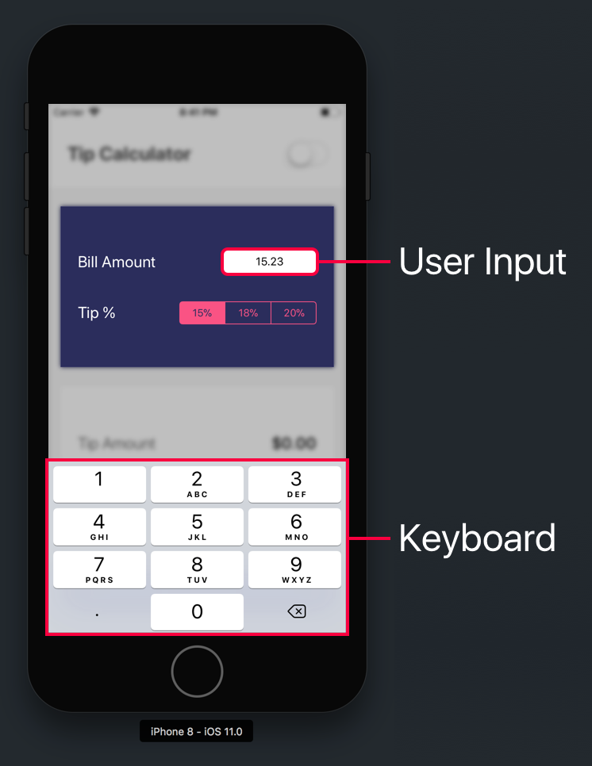
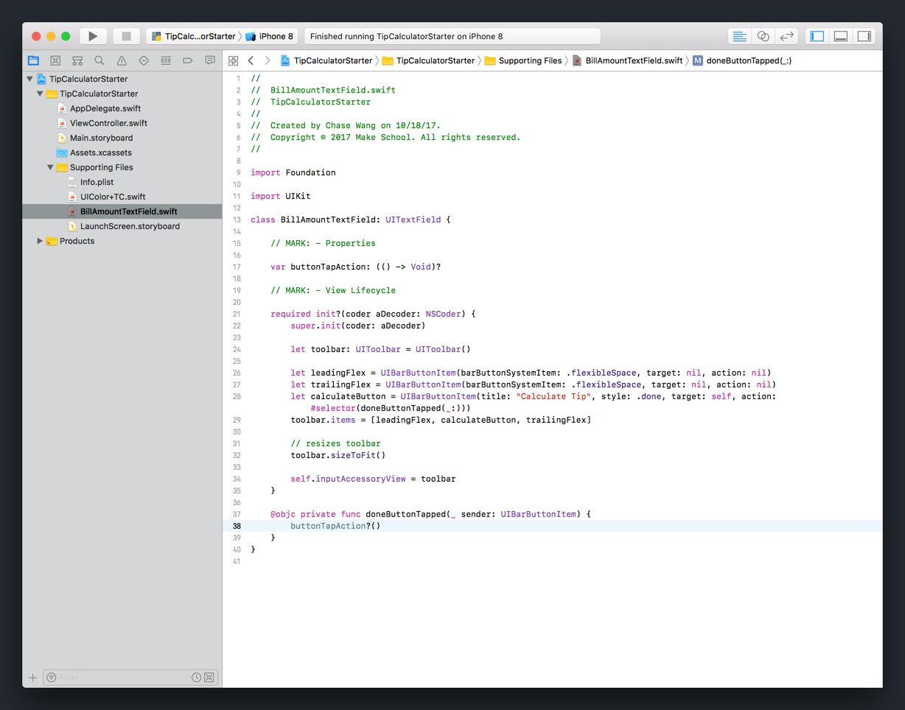
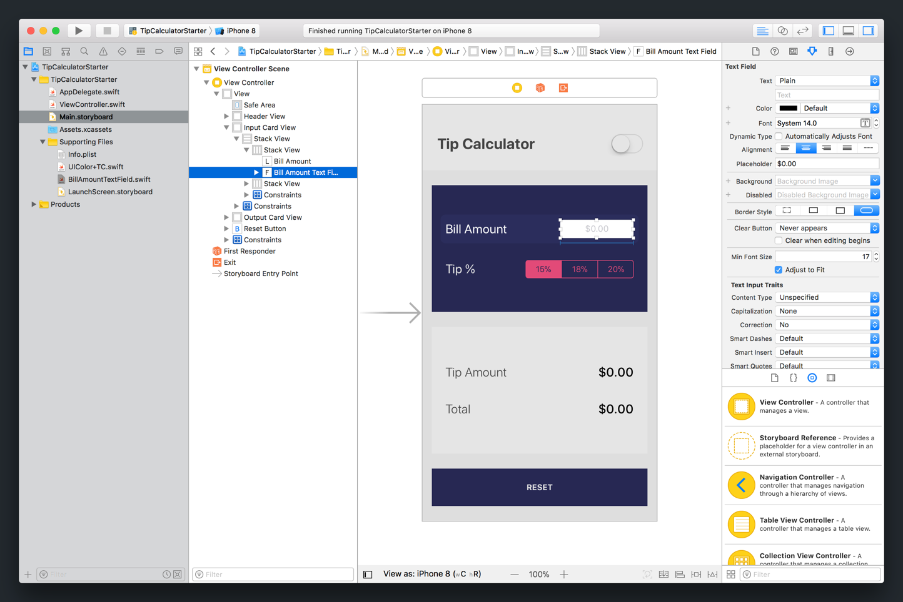
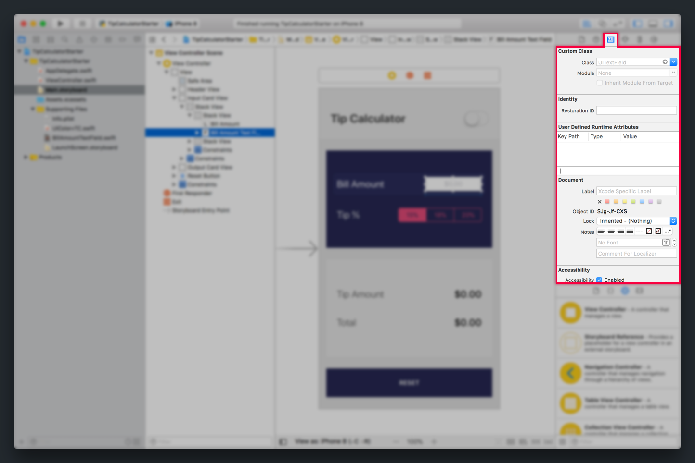
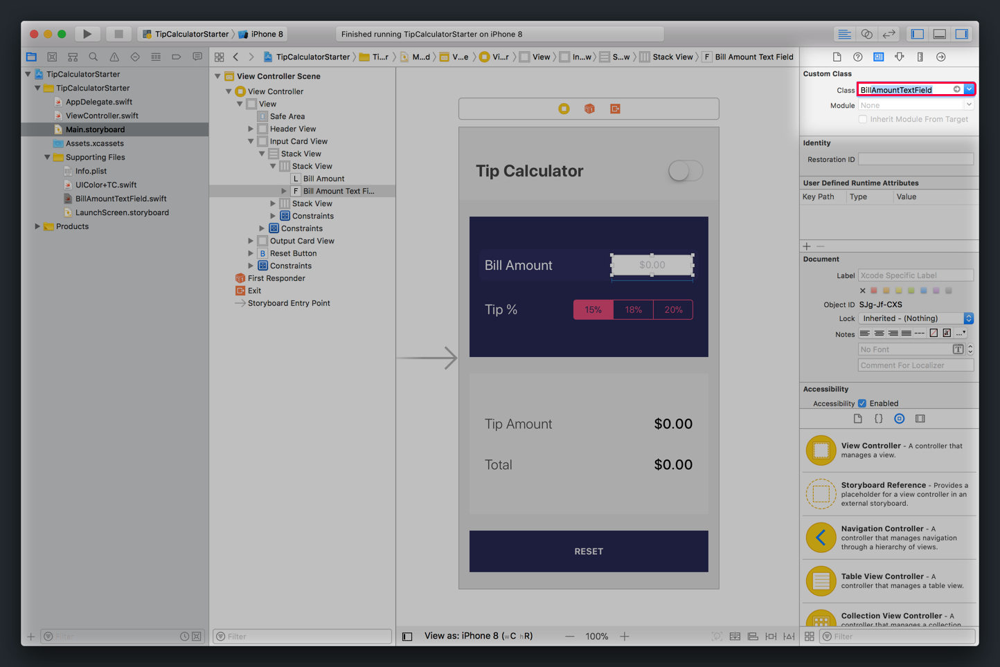
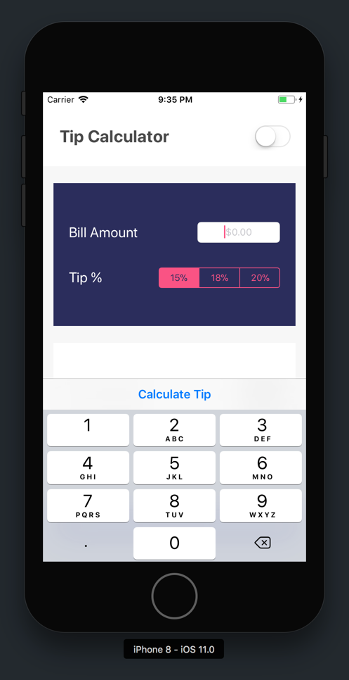
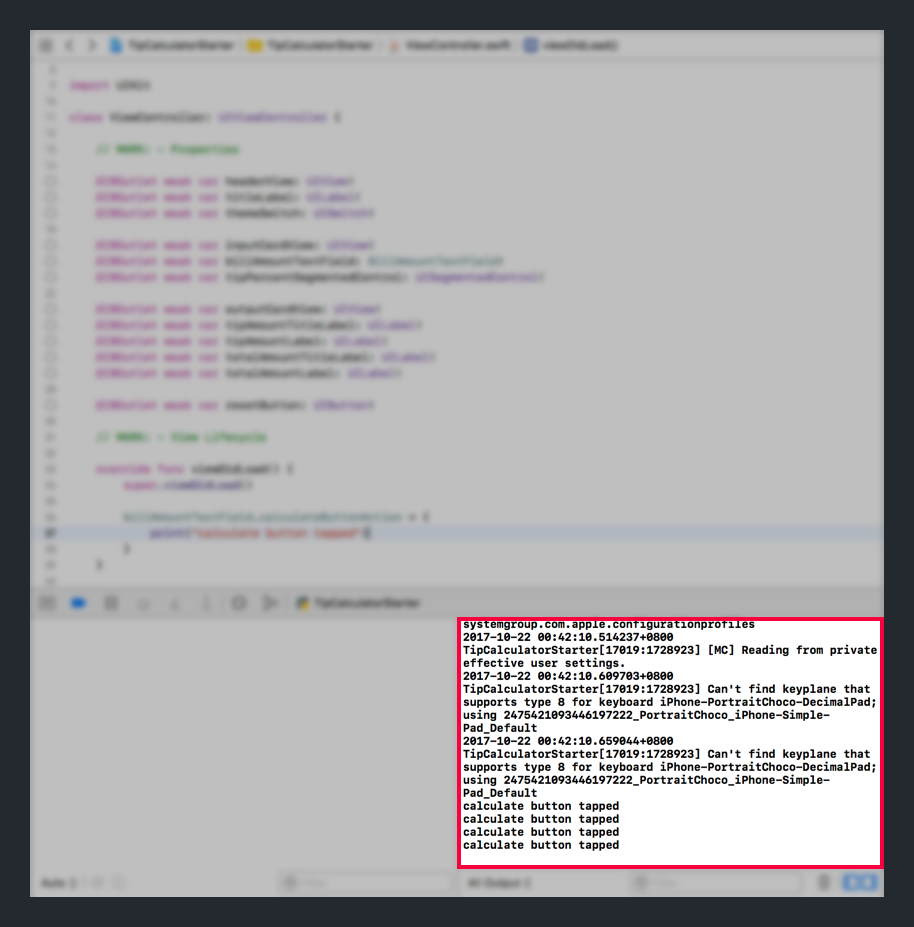
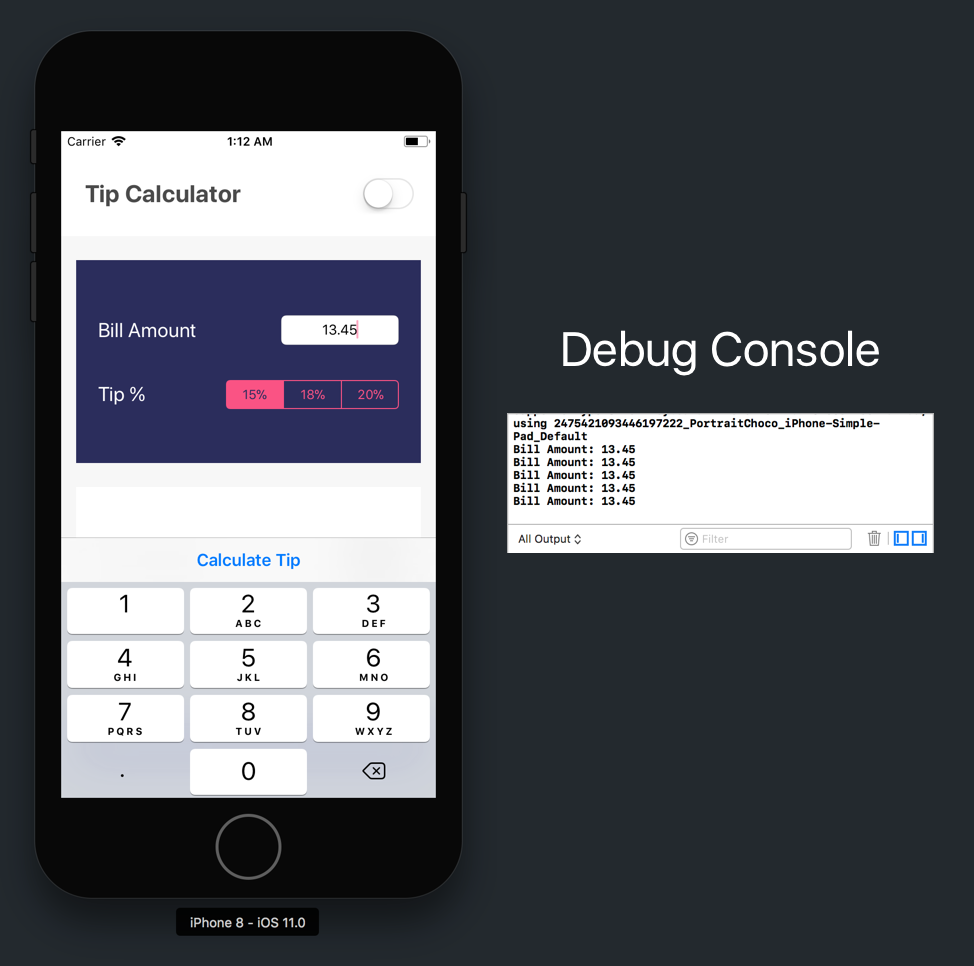
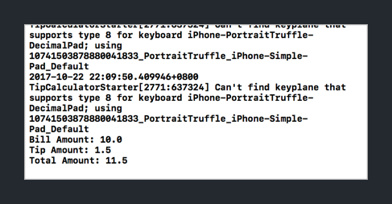
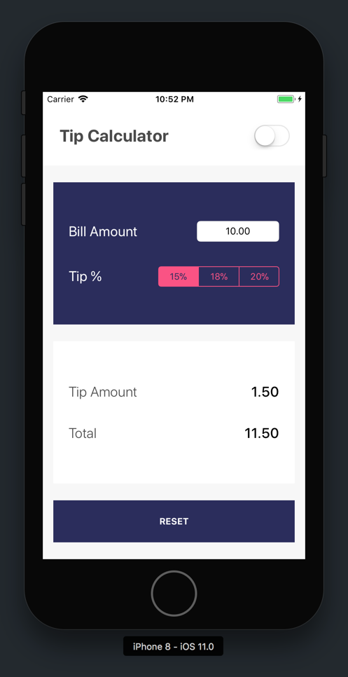

At this point, we've finished building our tip calculator's UI. However, if we launch our app and try to use it, nothing happens. Hmm... not particularly useful.

To prevent the angry pitchfork mob, we'll make our tip calculator work by writing code that:

1. takes the user's input
1. calculates the correct outputs
1. updates the UI with the output data

Let's start by figuring out how to access our user's original bill amount as input!

# Reading Bill Amount Input

To calculate our output, we'll first need the user to input their original bill amount.



When the user taps on the _Bill Amount Text Field_, the decimal pad keyboard will be displayed for user input. However, after the user is done typing their bill amount, there's no way for them to dismiss the keyboard.

We'll fix this first, by implementing a _Calculate Button_ that will appear right above the keyboard.

> [info]
To keep things simple, there's a bit of _magic_ that happens behind these scene for our soon-to-be calculate button. We've abstracted the majority into a custom `UITextField` subclasses which will replace our current `UITextField`. Even if you don't fully understand how our calculate button is being displayed, bear with us for now!

## Adding a Calculate Button

> [action]
Open `BillAmountTextField.swift` from your _Project Navigator_. You should see the following:
>


The biggest thing to note, is that `BillAmountTextField.swift` is a custom subclass of `UITextField`. Our custom text field has an _input accessory view_, or a view that will be positioned just above the keyboard.

Don't worry too much about the code in this file for now. In short, it creates our _Calculate Button_, positions it within the's text field's _input accessory view_. We'll see that in a second.

To use our subclass, we'll need to replace our current `UITextField` with our `BillAmountTextField` subclass.

> [action]
Open `Main.storyboard` and set `BillAmountTextField` as our _Bill Amount Text Field's_ custom class.
>
1. Select the _Bill Amount Text Field_ using the _Document Outline_. 
1. With the text field still selected, open the _Identity Inspector_ in the _Utilities area_. 
1. In the _Identity Inspector_, find the _Class_ field and set it to `BillAmountTextField`. As you start typing, auto-complete should complete the class you're looking for. If it doesn't, something's gone wrong! 

Next, we'll need to update our text field's corresponding `IBOutlet` in our Swift code.

> [action]
Open `ViewController.swift` and find the `IBOutlet` for your text field. Update your type of `billAmountTextField` from `UITextField` to `BillAmountTextField`:
>
```
class ViewController: UIViewController {
>
    // ...
>
    @IBOutlet weak var billAmountTextField: BillAmountTextField!
>
    // ...
>
}
```

That's it! We've set our text field to a custom `UITextField` subclass. Let's test our changes.

> [action]
Build and run your project. Tap on and select your `billAmountTextField`. The keyboard should slide up and you should see the following:
>


Do you see it? Right above the keyboard, you can see our new calculate button!

## Calculate Button Action

Next, we'll need to figure out a way to execute code when the _Calculate Button_ is tapped.

Open `BillAmountTextField.swift` from your _Project Navigator_.

Look for the `calculateButtonAction` property:

```
class BillAmountTextField: UITextField {

    // ...

    var calculateButtonAction: (() -> Void)?

    // ...

}
```

`calculateButtonAction` is a optional closure of type `(() -> Void)?`. Next, if you look for the `calculateButtonTapped(_:)` function, you'll see that `calculateButtonAction` is called each time the _Calculate Button_ is tapped:

```
class BillAmountTextField: UITextField {

    // ...

    @objc private func calculateButtonTapped(_ sender: UIBarButtonItem) {
        calculateButtonAction?()
    }
}
```

By setting the `calculateButtonAction` property of our custom text field, we can pass a closure that is executed each time the _Calculate Button_ is tapped.

> [info]
You might be scratching your head, wondering how `calculateButtonTapped(_:)` is set up to be called each time the _Calculate Button_ is tapped. We won't dive into too much details in this tutorial, but in short we've setup the equivalent `IBAction` programmatically with the following line of code:
>
```
let calculateButton = UIBarButtonItem(title: "Calculate Tip", style: .done, target: self, action: #selector(calculateButtonTapped))
```

Let's work on setting `calculateButtonAction` to execute a closure with a print statement.

> [action]
Open `ViewController.swift`. Add the following code to `viewDidLoad`:
>
```
override func viewDidLoad() {
    super.viewDidLoad()
>
    // 1
    billAmountTextField.calculateButtonAction = {
        // 2
        print("calculate button tapped")
    }
}
```
>
Step-by-step:
>
1. We set the `calculateButtonAction` variable of our `billAmountTextField` object to a new closure. To refresh your memory, a closure is a nameless function.
1. Within the closure, we can set any code we want to be executed when the closure is called. In this case, we add a simple print statement.

<!-- break -->

> [info]
**What is the `viewDidLoad` function and what does it do?**
>
`viewDidLoad` is one of many view controller lifecycle functions. These functions are inherited from the `UIViewController` object. Each lifecycle function defines important events such as a view controller appearing or disappearing from screen. In particular, `viewDidLoad` is called when the view controller's view hierarchy (the root view and it's subviews) are loaded into memory.
>
Other common view controller lifecycle functions include:
>
```
func viewWillAppear(_ animated: Bool) // Called when the view is about to made visible. Default does nothing
>
func viewDidAppear(_ animated: Bool) // Called when the view has been fully transitioned onto the screen. Default does nothing
>
func viewWillDisappear(_ animated: Bool) // Called when the view is dismissed, covered or otherwise hidden. Default does nothing
>
func viewDidDisappear(_ animated: Bool) // Called after the view was dismissed, covered or otherwise hidden. Default does nothing
>
func viewDidLayoutSubviews() // Called just after the view controller's view's layoutSubviews method is invoked. Subclasses can implement as necessary. The default is a nop.
```
>
For our case, `viewDidLoad` is useful for calling any setup code that we want to happen the first time the view controller's view loads.

Let's test that the closure we've set in our `viewDidLoad` method is called after tapping the _Calculate Button_.

> [action]
Build and run your project:
>
1. Tap on and select your `billAmountTextField`.
1. Tap on the _Calculate Button_ above your keyboard.
>
After tapping the _Calculate Button_ a couple times, check that the print statement appears in your debug console.
>


Nice! So far, we've successfully executing our print statement each time the _Calculate Button_ is tapped. Last, let's change our print statement to print out the actual bill amount that the user has input in the _Bill Amount Text Field_.

## Accessing Text Field Input

Just like all our other view objects, the `UITextField` is a class with many instance variables and functions. Since our `BillAmountTextField` is a custom subclass of `UITextField` it inherits all of it's instance functions and variables.

```
open class UITextField : UIControl, UITextInput, NSCoding, UIContentSizeCategoryAdjusting {

    open var text: String?

    @available(iOS 6.0, *)
    @NSCopying open var attributedText: NSAttributedString?

    open var textColor: UIColor?

    open var font: UIFont?

    // ...
}
```

Looking at the class definition of `UITextField`, you can see that accessing the text within a text field is a simple as reading it's `text` variable.

Let's try it out!

> [action]
Change the code in your `viewDidLoad` to the following:
>
```
override func viewDidLoad() {
    super.viewDidLoad()
>
    billAmountTextField.calculateButtonAction = {
        guard let billAmountText = self.billAmountTextField.text
            else { return }
>
        print("Bill Amount: \(billAmountText)")
    }
}
```
>
Notice in the code above, we use the `guard` keyboard to make sure `text` is a non-nil value. If the `text` value of our `billAmountTextField` is `nil`, the `guard` statement will return and the rest of the code in our closure won't be executed.
>
Let's test our code again.
>
1. Tap on and select your `billAmountTextField`.
1. Type a bill amount on the decimal pad keyboard.
1. Tap on the _Calculate Button_.
1. Check that the correct bill amount is printed in your debug console.
>


As you can see, the correct bill amount now prints in our debug console!

# Calculating Tip

Now that we've successfully read our user's bill amount input, we're going to implement the logic to calculate our outputs (tip amount + total amount.)

To calculate our outputs, we'll need to do the following:

1. Convert bill amount input from `String` to `Double`. The _Bill Amount_ value should be rounded to the 2 nearest decimal places.
1. Calculate the tip amount by multiplying the bill amount and tip percent. The tip amount should also be rounded to the 2 nearest decimal places.
1. Calculate the total amount by adding together the bill and tip amounts.

First, let's convert our bill amount input value from a `String` to a `Double`. We can do this using Swift's built-in type initializers.

Let's take a a look:

> [action]
Open `ViewController.swift` and change `viewDidLoad` to the following:
>
```
override func viewDidLoad() {
    super.viewDidLoad()
>
    billAmountTextField.calculateButtonAction = {
        // 1
        guard let billAmountText = self.billAmountTextField.text,
            let billAmount = Double(billAmountText) else {
                return
        }
>
        print("Bill Amount: \(billAmount)")
    }
}
```

As you can see, Swift provides us with type initializers that allow us to easily convert from one type to another. In this case, we use the `Double(_:)` initializer to convert our `billAmountText` value from `String` to `Double`. If the string is an invalid value that can't be converted to a double, our initializer will fail and return nil.

Next, let's clean up our bill amount input by rounding the value to the nearest two decimal places. We can use the `rounded()` function on type `Double` like the following:

> [action]
Sanitize the bill amount value by rounding to the nearest 2 decimal places:
>
```
override func viewDidLoad() {
    super.viewDidLoad()
>
    billAmountTextField.calculateButtonAction = {
        // 1
        guard let billAmountText = self.billAmountTextField.text,
            let billAmount = Double(billAmountText) else {
                return
        }
>
        let roundedBillAmount = (100 * billAmount).rounded() / 100
>
        print("Bill Amount: \(roundedBillAmount)")
    }
}
```

With our correctly formatted bill amount, we can calculate the tip amount of the bill. To start, let's use a fixed tip percent of 15%. While we're at it, let's also sanitize our tip amount by rounding to the nearest 2 decimal places.

> [info]
In the future, we'll use the segmented control to allow the user to select a dynamic tip percent.

<!-- break -->

> [action]
Calculate and sanitize the tip amount:
>
```
override func viewDidLoad() {
    super.viewDidLoad()
>
    billAmountTextField.calculateButtonAction = {
        // 1
        guard let billAmountText = self.billAmountTextField.text,
            let billAmount = Double(billAmountText) else {
                return
        }
>
        let roundedBillAmount = (100 * billAmount).rounded() / 100
>
        // 2
        let tipPercent = 0.15
        let tipAmount = roundedBillAmount * tipPercent
        let roundedTipAmount = (100 * tipAmount).rounded() / 100
>
        print("Bill Amount: \(roundedBillAmount)")
        print("Tip Amount: \(roundedTipAmount)")
    }
}
```

To wrap up our logic, we can calculate our total amount by adding together our tip and bill amounts.

> [action]
Calculate the total amount:
>
```
override func viewDidLoad() {
    super.viewDidLoad()
>
    billAmountTextField.calculateButtonAction = {
        // 1
        guard let billAmountText = self.billAmountTextField.text,
            let billAmount = Double(billAmountText) else {
                return
        }
>
        let roundedBillAmount = (100 * billAmount).rounded() / 100
>
        // 2
        let tipPercent = 0.15
        let tipAmount = roundedBillAmount * tipPercent
        let roundedTipAmount = (100 * tipAmount).rounded() / 100
>
        // 3
        let totalAmount = roundedBillAmount + roundedTipAmount
>
        print("Bill Amount: \(roundedBillAmount)")
        print("Tip Amount: \(roundedTipAmount)")
        print("Total Amount: \(totalAmount)")
    }
}
```

Let's test our logic to see if it's working as expected.

> [action]
Build and run your project. Test a couple values and verify that the print statements in the debug console are correct.
>


# Setting The Output Card

We'll need to update the UI with the output values that we've calculated. But first, we'll need to dismiss the keyboard so it isn't covering the output card.

> [action]
In `ViewController.swift`, add the following lines of code in `viewDidLoad`:
>
```
billAmountTextField.calculateButtonAction = {
    // dismiss keyboard if it's displayed
    if self.billAmountTextField.isFirstResponder {
        self.billAmountTextField.resignFirstResponder()
    }
>
    // ...
}
```

If you build and run your project again. Now, after tapping the _Calculate Button_, the keyboard will be dismissed.

Now that our output card is no longer being hidden, we can work on updating the UI.

If you take a look at the `UILabel` class definition, you'll see the following:

```
class UILabel : UIView, NSCoding, UIContentSizeCategoryAdjusting {

    var text: String?

    var font: UIFont!

    var textColor: UIColor!

    // ...

}
```

To update the text that a `UILabel` displays, we can use the `text` property of each `UILabel`. Let's update our `calculateButtonAction` closure so that it sets the output card's tip amount and total amount labels.

> [action]
In `ViewController.swift`, update your code update the output card's labels:
>
```
override func viewDidLoad() {
    super.viewDidLoad()
>
    billAmountTextField.calculateButtonAction = {
        // dismiss keyboard if it's displayed
        if self.billAmountTextField.isFirstResponder {
            self.billAmountTextField.resignFirstResponder()
        }
>
        guard let billAmountText = self.billAmountTextField.text,
            let billAmount = Double(billAmountText) else {
                return
        }
>
        let roundedBillAmount = (100 * billAmount).rounded() / 100
>
        let tipPercent = 0.15
        let tipAmount = roundedBillAmount * tipPercent
        let roundedTipAmount = (100 * tipAmount).rounded() / 100
>
        let totalAmount = roundedBillAmount + roundedTipAmount
>
        // Update UI
        self.billAmountTextField.text = String(format: "%.2f", roundedBillAmount)
        self.tipAmountLabel.text = String(format: "%.2f", roundedTipAmount)
        self.totalAmountLabel.text = String(format: "%.2f", totalAmount)
    }
}
```
>
The code we just added, updates the UI by setting each corresponding label's `text` property to a formatted string.
>
Build and run your project. Input a bill amount and tap the _Calculate Button_. If it works, you should see your tip and bill amounts show up on the output card!
>


# Refactoring Our Calculate Logic

Before moving on, let's refactor some of our existing code. Right now, the majority of our logic for calculating the tip and bill amounts are in our `calculateButtonAction` closure.

Let's move our logic out into it's own function so it can be re-used.

> [action]
In `ViewController.swift`, create a new function for calculating tip:
>
```
func calculate() {
    // dismiss keyboard
    if self.billAmountTextField.isFirstResponder {
        self.billAmountTextField.resignFirstResponder()
    }
>
    guard let billAmountText = self.billAmountTextField.text,
        let billAmount = Double(billAmountText) else {
            return
    }
>
    let roundedBillAmount = (100 * billAmount).rounded() / 100
>
    let tipPercent = 0.15
    let tipAmount = roundedBillAmount * tipPercent
    let roundedTipAmount = (100 * tipAmount).rounded() / 100
>
    let totalAmount = roundedBillAmount + roundedTipAmount
>
    // Update UI
    self.billAmountTextField.text = String(format: "%.2f", roundedBillAmount)
    self.tipAmountLabel.text = String(format: "%.2f", roundedTipAmount)
    self.totalAmountLabel.text = String(format: "%.2f", totalAmount)
}
```

Next, let's change our `calculateButtonAction` closure to use our `calculate` method.

> [action]
In `ViewController.swift`, change `viewDidLoad` to the following:
>
```
override func viewDidLoad() {
    super.viewDidLoad()
>
    billAmountTextField.calculateButtonAction = {
        self.calculate()
    }
}
```

We've separated our logic into it's own function. This will help us as we implement our `UISegmentedControl`.

# Setting Tip Percent

Our UI is being correctly updated when we calculate our tip. Next, let's go back and implement our `UISegmentedControl`.

Currently, our view controller contains an `IBAction` that is triggered each time the user selects a new segment of the `UISegmentedControl`. When this `IBAction` is triggered, we want to re-calculate our tip using the new selected tip percent.

First, let's update our `IBAction` to calculate the tip whenever a segment is selected.

> [action]
In `ViewController.swift`, update `tipPercentChanged(_:)` to the following:
>
```
@IBAction func tipPercentChanged(_ sender: UISegmentedControl) {
    calculate()
}
```

Next, we'll update our calculate function to use the correct tip percent of the `UISegmentedControl`.

> [action]
In `ViewController.swift`, change the `calculate()` function to the following:
>
```
func calculate() {
    // dismiss keyboard
    if self.billAmountTextField.isFirstResponder {
        self.billAmountTextField.resignFirstResponder()
    }
>
    guard let billAmountText = self.billAmountTextField.text,
        let billAmount = Double(billAmountText) else {
            return
    }
>
    let roundedBillAmount = (100 * billAmount).rounded() / 100
>
    let tipPercent: Double
    switch tipPercentSegmentedControl.selectedSegmentIndex {
    case 0:
        tipPercent = 0.15
    case 1:
        tipPercent = 0.18
    case 2:
        tipPercent = 0.20
    default:
        preconditionFailure("Unexpected index.")
    }
>
    let tipAmount = roundedBillAmount * tipPercent
    let roundedTipAmount = (100 * tipAmount).rounded() / 100
>
    let totalAmount = roundedBillAmount + roundedTipAmount
>
    // Update UI
    self.billAmountTextField.text = String(format: "%.2f", roundedBillAmount)
    self.tipAmountLabel.text = String(format: "%.2f", roundedTipAmount)
    self.totalAmountLabel.text = String(format: "%.2f", totalAmount)
}
```
>
In the code above, we use the `selectedSegmentIndex` of our segmented control with a `switch` statement to determine the correct tip percent. `tipPercent` is then used to correctly calculate our tip.

Let's test out our new changes!

> [action]
Build and run your project. Use different combinations of bill amounts and tip percents and see if the output card updates correctly.

# Reset Button

To finish up our logic, let's implement our reset functionality.

Similar to our `calculate` logic, let's separate our reset logic into it's own function.

In our reset logic, we'll want to reset our tip calculator to it's initial state. We'll need to remember to do the following:

- Set the text field's `text` value to `nil`
- Set the segmented control's `selectedSegmentIndex` to `0`
- Set both output labels on the output card back to `$0.00`

> [challenge]
Try implementing the logic above in a function called `clear()`.

<!-- break -->

> [solution]
Your new `clear()` function should be the following:
>
```
func clear() {
    billAmountTextField.text = nil
    tipSegmentedControl.selectedSegmentIndex = 0
    tipAmountLabel.text = "$0.00"
    totalCostLabel.text = "$0.00"
}
```

Next, we'll need to update the `IBAction` of our reset button.

> [action]
In `ViewController.swift`, update your `resetButtonTapped(_:)` method with the following:
>
```
@IBAction func resetButtonTapped(_ sender: UIButton) {
    clear()
}
```

Last, when our `calculate` gets invalid input, let's also reset the calculator's state.

> [action]
Change `calculate()` to the following:
>
```
func calculate() {
    // dismiss keyboard
    if self.billAmountTextField.isFirstResponder {
        self.billAmountTextField.resignFirstResponder()
    }
>
    guard let billAmountText = self.billAmountTextField.text,
        let billAmount = Double(billAmountText) else {
            clear()
            return
    }
>
    // ...
>
}
```

# Conclusion

It works! In this section, we've taken our UI and IB connections and implemented the logic behind our tip calculator.

We started by retrieving the user's input from the _Bill Amount Text Field_. Next, we used the user's input to calculate bill's tip and total amounts. To finish up, we updated our UI by setting each respective label on our _Output Card_.

In the next section, we'll finish the remaining styling and functionality of our tip calculator!
