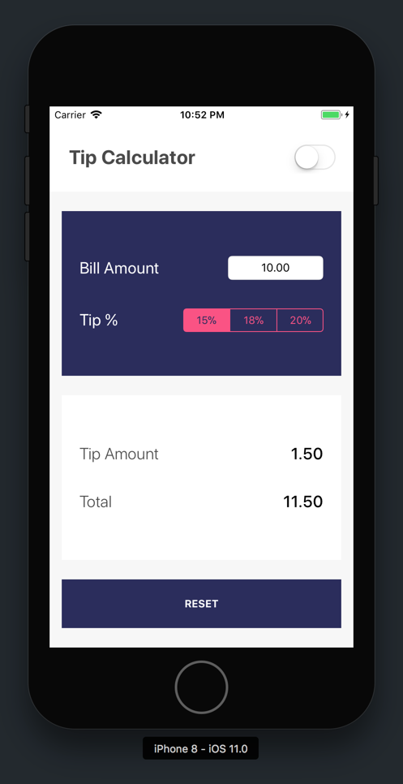
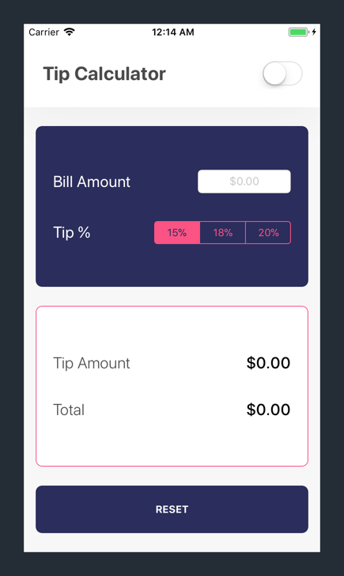
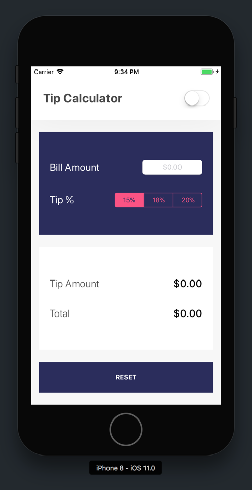
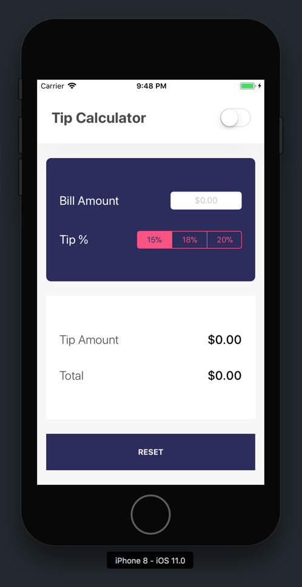
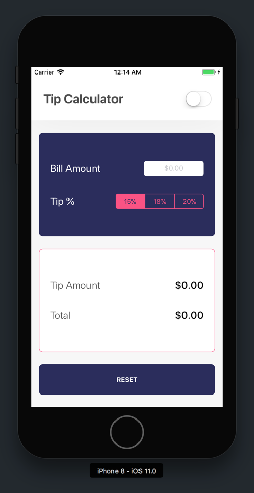
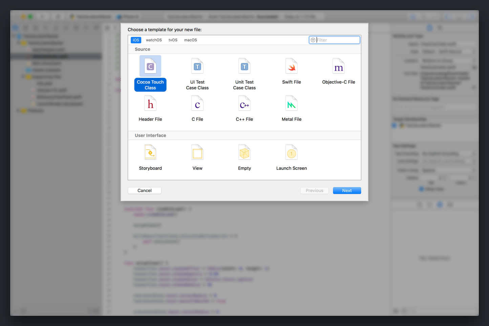
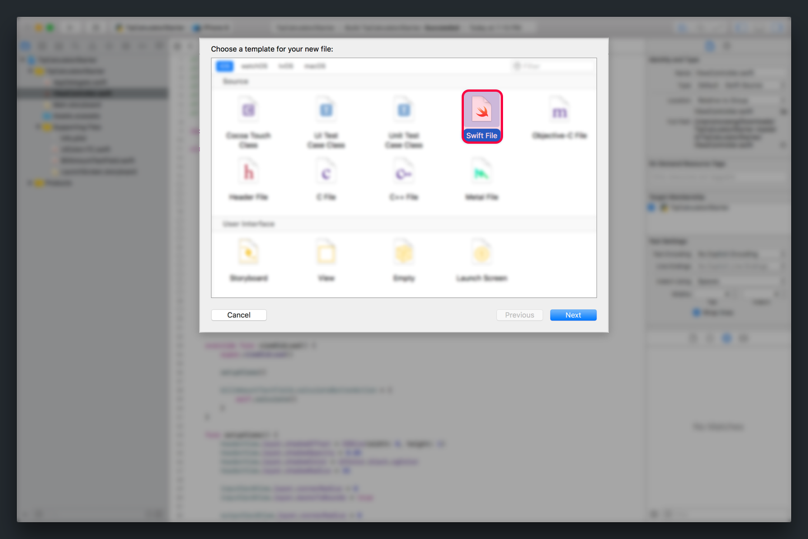
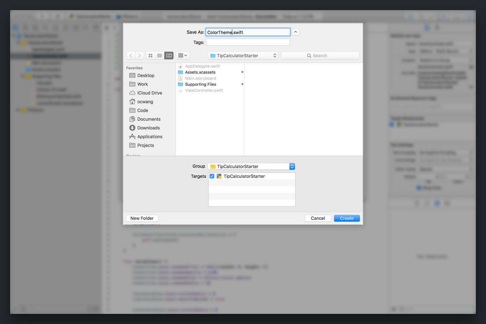
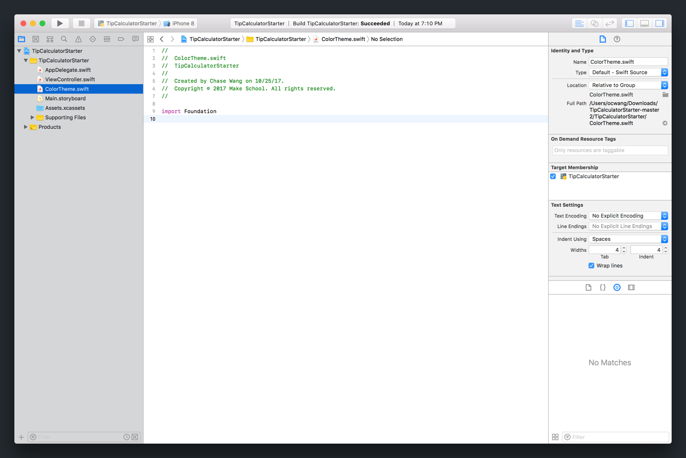
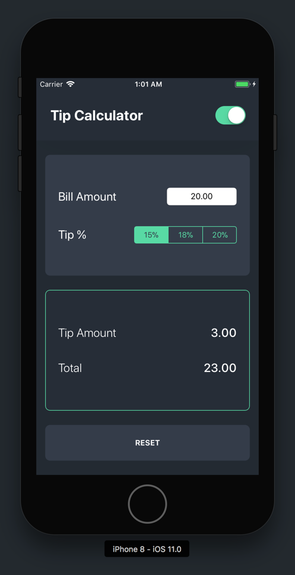

To finish our tip calculator, we'll need to add some final touches to styling and implement our light/dark theme switch.

Let's review what our app looks like so far:



Next, let's take a look at our designs:



Although the differences are subtle, to complete our UI, we'll need to add the following:

- header view shadow
- input card rounded corners
- output card rounded corners
- reset button rounded corners
- output card border

Let's start by making these changes!

# Configuring Layers

To make our final UI changes, we'll need to learn about `CALayer`.

Each `UIView` object has a `layer` property of type `CALayer`. The view's layer is a lower-level API that gives developers more control on how the view is rendered.

By using each view's `layer` property, we can easily create shadows, add rounded corners and display borders.

Before we start with configuring our view's layers, let's first create a new, empty method in our view controller.

> [action]
In `ViewController.swift`, add the following function:
>
```
func setupViews() {
    // nothing yet
}
```

We'll use this method to add code that initially configures each view's respective layer.

This function will need to be called at the beginning of the view controller's lifecycle so it initially makes all of our layer customizations.

> [action]
In `ViewController.swift`, call `setupViews()` in `viewDidLoad()`:
>
```
override func viewDidLoad() {
    super.viewDidLoad()
>
    setupViews()
>
    billAmountTextField.calculateButtonAction = {
        self.calculate()
    }
}
```

With our near `setupViews()` method, we can add the code for adding a shadow to the bottom of the header view.

> [action]
Add a shadow by configuring the _Header View's_ layer:
>
```
func setupViews() {
    headerView.layer.shadowOffset = CGSize(width: 0, height: 1)
    headerView.layer.shadowOpacity = 0.05
    headerView.layer.shadowColor = UIColor.black.cgColor
    headerView.layer.shadowRadius = 35
}
```
>
`CALayer` has many attributes that allow you to configure a view's appearance. In the code above, we add code to create a slight shadow for our _Header View_.
>
Build and run your project. You should see your shadow appear under your _Header View_:
>


<!-- break -->

> [info]
The shadow in our UI is soft and can be hard to see. If you want to test that your code works, you can adjust the layer's `shadowOpacity` to a value closer to `1`. Don't forget to change the value back after testing.

Next, we'll look at setting a view's layer to have rounded corners.

## Rounded Corners

Similar to setting our shadow, each `CALayer` also has a `cornerRadius` property that we can adjust to give our view a rounded corner.

Let's add the code to give our _Input Card_ rounded corners.

> [action]
Add rounded corners to the input card:
>
```
func setupViews() {
    headerView.layer.shadowOffset = CGSize(width: 0, height: 1)
    headerView.layer.shadowOpacity = 0.05
    headerView.layer.shadowColor = UIColor.black.cgColor
    headerView.layer.shadowRadius = 35
>
    inputContainerView.layer.cornerRadius = 8
    inputContainerView.layer.masksToBounds = true
}
```
>
It's important to note that we also set the layer's `maskToBounds` property to `true`. This prevents our view's content from appearing outside of our rounded corner's boundary.

Let's test that our code works!

> [action]
Build and run your project the updates to your UI:
>


Easy enough! Time to practice on your own.

> [challenge]
Add rounded corners (with the same corner radius as above) to give both the `outputCardView` and `resetButton` rounded corners.

<!-- break -->

> [solution]
To add rounded corners for both views, you should have added the code below to your `setupViews()` method:
>
```
func setupViews() {
>
    // ...
>
    outputCardView.layer.cornerRadius = 8
    outputCardView.layer.masksToBounds = true
>
    resetButton.layer.cornerRadius = 8
    resetButton.layer.masksToBounds = true
}
```

## Borders

To finish up our UI changes, we'll need to add a border to our output card. Again, `CALayer` has two properties: `borderWidth` and `borderColor` that allow us to set a border for a layer. No surprise...

> [action]
Add the following code to `setupViews()`:
>
```
func setupViews() {
>
    // ...
>
    outputCardView.layer.cornerRadius = 8
    outputCardView.layer.masksToBounds = true
>
    // set output card border
    outputCardView.layer.borderWidth = 1
    outputCardView.layer.borderColor = UIColor.tcHotPink.cgColor
>
    resetButton.layer.cornerRadius = 8
    resetButton.layer.masksToBounds = true
}
```

We've finished styling our tip calculator's subviews. Your tip calculator should look like the following:



# Light / Dark Theme

The last feature we need to implement is the ability to toggle themes. Currently, our app has a light colored theme. When we're finished, our `UISwitch` will be able to toggle from our light colored theme to a dark one (and vice versa.)

Let's start by creating a new function that will eventually contain all our theme switching code.

> [action]
In `ViewController.swift`, add the following new method:
>
```
func setTheme(isDark: Bool) {
>
}
```

Next, we'll create a new data structure that contains each theme's color information. When we're done, we'll be able to use this object to switch between themes.

> [action]
Create a new `ColorTheme` struct:
>
1. Press CMD-N to create a new file into your project. 
1. Select _Swift File_ and click _Next_ . 
1. Name your new Swift file `ColorTheme.swift` and click _Create_. 
>
When you're finished, you should see a new Swift source file named `ColorTheme.swift`:
>


With our new source file, we can create our `ColorTheme` data structure.

> [action]
In `ColorTheme.swift`, add the following code:
>
```
import UIKit
>
struct ColorTheme {
>
    // MARK: - Instance Vars
>
    let isDefaultStatusBar: Bool
    let viewControllerBackgroundColor: UIColor
>
    let primaryColor: UIColor
    let primaryTextColor: UIColor
>
    let secondaryColor: UIColor
>
    let accentColor: UIColor
    let outputTextColor: UIColor
}
```
>
We create a new `struct` that contains the data for each theme. Each property in `ColorTheme` sets the color of a corresponding view in our tip calculator's UI.

Using our `ColorTheme` struct, we can create our light and dark color themes. We'll do this using class variables.

> [action]
In `ColorTheme.swift`, create two new class variables:
>
```
struct ColorTheme {
>
    // MARK: - Class Vars
>
    static let light = ColorTheme(isDefaultStatusBar: true,
                                  viewControllerBackgroundColor: .tcOffWhite,
                                  primaryColor: .tcWhite,
                                  primaryTextColor: .tcCharcoal,
                                  secondaryColor: .tcDarkBlue,
                                  accentColor: .tcHotPink,
                                  outputTextColor: .tcAlmostBlack)
>
    static let dark = ColorTheme(isDefaultStatusBar: false,
                                 viewControllerBackgroundColor: .tcAlmostBlack,
                                 primaryColor: .tcMediumBlack,
                                 primaryTextColor: .tcWhite,
                                 secondaryColor: .tcBlueBlack,
                                 accentColor: .tcSeafoamGreen,
                                 outputTextColor: .tcWhite)
>
    // ...
>
}
```

We can use the data from the class variables we created to change the current color theme of our tip calculator.

> [action]
In `ViewController.swift`, update `setTheme(isDark:)` to use our change the color of our tip calculator depending on the active theme.
>
```
func setTheme(isDark: Bool) {
    let theme = isDark ? ColorTheme.dark : ColorTheme.light
>
    view.backgroundColor = theme.viewControllerBackgroundColor
>
    headerView.backgroundColor = theme.primaryColor
    titleLabel.textColor = theme.primaryTextColor
>
    inputCardView.backgroundColor = theme.secondaryColor
>
    billAmountTextField.tintColor = theme.accentColor
    tipPercentSegmentedControl.tintColor = theme.accentColor
>
    outputCardView.backgroundColor = theme.primaryColor
    outputCardView.layer.borderColor = theme.accentColor.cgColor
>
    tipAmountTitleLabel.textColor = theme.primaryTextColor
    totalAmountTitleLabel.textColor = theme.primaryTextColor
>
    tipAmountLabel.textColor = theme.outputTextColor
    totalAmountLabel.textColor = theme.outputTextColor
>
    resetButton.backgroundColor = theme.secondaryColor
}
```

In addition, we'll need to add some more code to make sure the color of our status bar is correctly updated.

> [action]
In `ViewController.swift`, add the following properties to the top of your class:
>
```
class ViewController: UIViewController {
>
    // MARK: - Properties
>
    // 1
    var isDefaultStatusBar = true
>
    // 2
    override var preferredStatusBarStyle: UIStatusBarStyle {
        return isDefaultStatusBar ? .default : .lightContent
    }
>
    // ...
>
}
```
>
Explaining the new properties we added:
>
1. `isDefaultStatusBar` keeps our `Bool` of whether we should show the default or light status bar. If default, the status bar color is black.
1. We override the `preferredStatusBarStyle` property and use `isDefaultStatusBar` to set our view controller's status bar style.
>
You might be wondering 'Why we need two properties to set the status bar style?'. Good question. Our `preferredStatusBarStyle` property is inherited from our super class and can't be set directly. Because of this, we need our `isDefaultStatusBar` variable to keep track of which status bar style `preferredStatusBarStyle` should display.

<!-- break -->

To make sure our status bar is updated when our theme is toggled, we'll need to add the following code to our `setTheme(isDark:)` method.

> [action]
In `ViewController.swift`, update `setTheme(isDark:)`:
>
```
func setTheme(isDark: Bool) {
>
    // ...
>
    isDefaultStatusBar = theme.isDefaultStatusBar
    setNeedsStatusBarAppearanceUpdate()
}
```

## Implementing Our IBAction

To toggle our theme each time our `UISwitch` is toggled, we'll need to connect our `setTheme(isDark:)` to our `themeToggled(_:)` method.

> [action]
Call `setTheme(isDark:)` in `themeToggled(_:)`:
>
```
@IBAction func themeToggled(_ sender: UISwitch) {
    setTheme(isDark: sender.isOn)
}
```
>
Our theme will be switched from light to dark and vice versa each time our `UISwitch` is toggled. The theme will be set corresponding to the switch's `isOn` property.

## Initial Theme Setup

To clean up, we'll need to make sure to set the initial theme state for our tip calculator. We can do this by calling our `setTheme(isDark:)` at the beginning of our view controller lifecycle.

> [action]
In `ViewController.swift`, change your view controller to the following:
>
```
override func viewDidLoad() {
    super.viewDidLoad()
>
    setupViews()
    setTheme(isDark: false)
>
    billAmountTextField.calculateButtonAction = {
        self.calculate()
    }
}
```
>
We call `setTheme(isDark: false)` so that when our view controller's view are first setup, our initial theme will be set.

Let's test our code to see if it works!

> [action]
Build and run your project. Toggle the `UISwitch` to switch between light and dark color themes. If everything goes well, you should be able to use your tip calculator in dark mode! Which theme do you like better?
>


After implementing our theming feature, we've completed our tip calculator's functionality and design! In the next section, we'll review what we've learned and set you on a challenge to practice your new skills.
