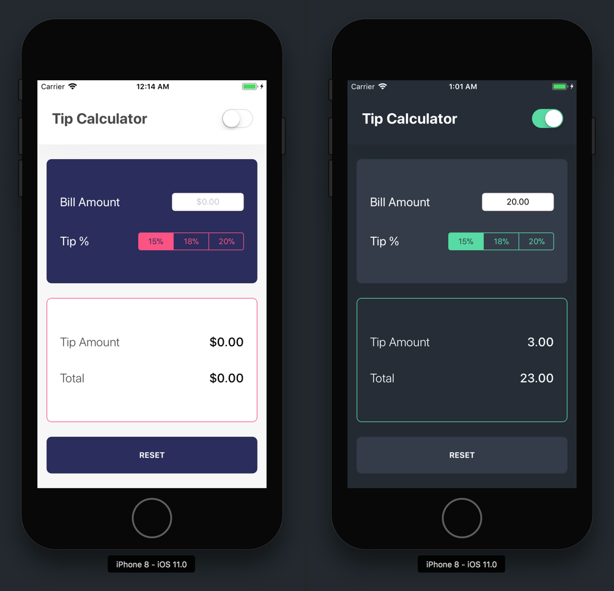

Well done! You've finished your second iOS tutorial.

Along the way, you've picked up some new skills:

- how to visually breakdown designs into views
- how to identify and use view components in UIKit
- how to create UI layouts with auto-layout, constraints and stack views
- how to programmatically get and set class properties

We've also got to review the basics:

- navigating Xcode files using the _Project Navigator_
- using the _Assistant Editor_ to display files side-by-side
- creating `IBOutlet` and `IBAction` connections with _Interface Builder_

Another app built. You're well on your way to becoming an awesome iOS developer.

Stop and take a moment to appreciate how far you've come!

# A Challenge Approaches

You're not done yet. After you finish soaking in the feel-good emotions, it's time to put your skills to the test.

## The Challenge

If you're from another country, or just an avid traveller, you'll know that many countries don't have a custom of tipping. In these countries, our tip calculator won't do us much good.

So instead, you're going to build a _Currency Exchange Calculator_ that you can use when you're traveling abroad. To build our _Currency Exchange Calculator_ app, we'll use make of the same skills and concepts we learned during this tutorial.

As always, try completing this challenge as much on your own as possible. If you do get stuck, you can always refer back to this tutorial for help!

## App Design

<!-- TODO: add designs above -->

Above is an example design you can use to build your _Currency Exchange Calculator_. Feel free to get creative and add your own style into the app design.

## Specs

Just like your _Tip Calculator_, your _Currency Exchange Calculator_ app will involve reading user input and converting it to a different value.

Your app should take a input of U.S. dollars and convert it into a currency of your choice when the user taps the _Calculate Button_. Some popular currencies you can consider using include the following: Euro, Yen, Rupee, Bitcoin.

> [info]
For your exchange calculation, find the currency conversion rate online and hard-code it into your app.

Good luck the challenge! Remember, you can look back on the tutorial or your previous code if you get stuck.
